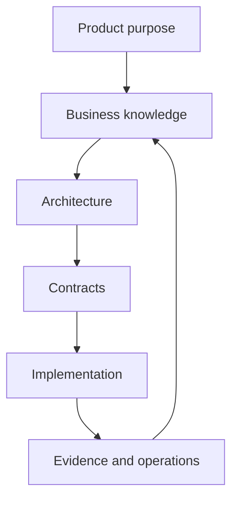

# KGAID Principles

## 1. Purpose

This document defines the foundational principles of Knowledge-Governed AI-Assisted Development (KGAID).

The principles govern how the methodology is designed, interpreted, adopted, and evolved. They are normative: a KGAID process, practice, artifact, profile, or tool MUST remain consistent with them.

The principles are intentionally independent of programming language, framework, architectural style, repository platform, delivery method, and AI provider.

## 2. Normative Language

The terms **MUST**, **MUST NOT**, **SHOULD**, **SHOULD NOT**, and **MAY** express the strength of a rule:

- **MUST** and **MUST NOT** define requirements necessary for consistency with KGAID;
- **SHOULD** and **SHOULD NOT** define strong recommendations that MAY be departed from when the reason is explicit;
- **MAY** defines an optional practice.

A project MAY tailor how a principle is realized, but it MUST NOT reverse the principle's meaning while claiming KGAID conformance.

## 3. Foundational Principles

### P1. Knowledge is the primary project asset

**Statement:** A software project MUST treat validated knowledge as the basis for coordinated action. Code is an important product of knowledge, but it is not the sole or automatically authoritative source of truth.

**Rationale:** A system cannot be understood or safely changed from implementation alone. Product intent, business rules, decisions, contracts, constraints, risks, and evidence carry meaning that code can only partially express.

**Consequences:**

- important knowledge MUST be made explicit enough to be discovered, reviewed, and used;
- code SHOULD be traceable to the knowledge that justifies its existence and behavior;
- knowledge quality MUST be evaluated by usefulness, authority, evidence, and currency—not by document volume;
- undocumented implementation behavior MUST NOT silently redefine accepted product intent or contracts.

### P2. Product purpose precedes solution design

**Statement:** A project MUST establish why a product or change SHOULD exist before committing to how it will be built.

**Rationale:** A technically correct solution can still solve the wrong problem. Product vision, stakeholder outcomes, scope, constraints, and success criteria give direction to every later decision.

**Consequences:**

- a proposed solution MUST be evaluated against explicit product outcomes;
- solution preferences MUST NOT substitute for a problem statement;
- unresolved product uncertainty SHOULD remain visible rather than being concealed by premature implementation detail;
- a change that cannot be related to a product need, obligation, risk reduction, or learning goal SHOULD be challenged.

### P3. Business knowledge precedes architecture

**Statement:** Architecture MUST be derived from sufficiently understood business and domain knowledge.

**Rationale:** Architectural boundaries, responsibilities, data, interactions, and quality priorities are meaningful only in relation to the business capabilities and rules they serve.

**Consequences:**

- domain terminology, actors, rules, processes, constraints, and significant scenarios SHOULD be understood before irreversible architectural commitments;
- architectural decisions MUST identify the business drivers and quality concerns they address;
- technical convenience MUST NOT silently redefine business meaning;
- discoveries that change domain understanding MUST trigger review of affected architectural decisions.

This principle does not require complete business knowledge before architecture begins. It requires uncertainty to be explicit and architectural commitment to be proportional to what is known.

### P4. Architecture precedes implementation

**Statement:** The structural and behavioral decisions necessary to guide a change MUST be made before implementation depends on them.

**Rationale:** Implementation without sufficient architectural direction creates accidental structure, inconsistent boundaries, and decisions hidden inside code.

**Consequences:**

- system boundaries, responsibilities, dependencies, and significant quality strategies MUST be explicit at the level required by the change;
- implementation MAY begin while architecture evolves, provided unresolved decisions and their risks are visible;
- code MUST NOT be used to bypass a required architectural decision;
- discoveries made during implementation MUST be fed back into architectural knowledge.

Architecture in KGAID means the set of significant decisions, not a mandatory collection of diagrams or a separate design phase.

### P5. Contracts precede the code that realizes them

**Statement:** Observable obligations between actors or system elements MUST be agreed before their implementation is treated as complete.

**Rationale:** Without an explicit contract, independently produced components MAY be locally correct but mutually incompatible. Code-first inference makes accidental behavior difficult to distinguish from intended behavior.

**Consequences:**

- relevant interface, data, behavioral, quality, failure, and compatibility expectations MUST be explicit before dependent implementation is accepted;
- a contract MAY be expressed through specifications, schemas, examples, tests, formal models, or another verifiable form;
- contract changes MUST be reviewed for consumers, compatibility, migration, and operational impact;
- generated code or tests MUST NOT become the contract merely because a tool produced them first.

The required formality depends on risk, number of consumers, reversibility, and expected lifetime.

### P6. Decisions are explicit, attributable, and authoritative

**Statement:** A consequential project choice MUST be distinguishable from an idea, observation, recommendation, or AI-generated proposal.

**Rationale:** Teams cannot coordinate reliably when decisions are implicit, their owners are unknown, or conflicting statements appear equally valid.

**Consequences:**

- significant decisions MUST record their context, outcome, rationale, authority, and lifecycle state;
- the source and status of knowledge MUST be visible;
- conflicting authoritative knowledge MUST be resolved or explicitly escalated;
- superseded decisions SHOULD remain available when their history is needed to understand the present;
- conversation, popularity, repetition, or implementation alone MUST NOT grant authority.

### P7. Traceability connects intent to evidence

**Statement:** Important knowledge MUST be connected across the path from product intent to operational evidence.

**Rationale:** Traceability enables understanding, review, impact analysis, and confidence that a delivered result still serves its purpose.

**Consequences:**

- relationships between goals, domain knowledge, requirements, decisions, architecture, contracts, implementation, verification, and operations SHOULD be explicit where they affect meaningful risk;
- traceability MUST support navigation in both directions when impact or justification MUST be assessed;
- every file and line of code need not have an individual trace link;
- traceability SHOULD be created when knowledge is produced, not reconstructed only during an audit;
- a broken or ambiguous critical trace MUST be treated as a knowledge defect.

### P8. Claims do not exceed evidence

**Statement:** A conclusion about correctness, quality, security, compliance, or readiness MUST remain within the scope supported by its evidence.

**Rationale:** Passing tests or successful local observations are valuable, but they do not prove claims outside the conditions they actually examined.

**Consequences:**

- evidence MUST identify what was evaluated, under which conditions, and with what limitations;
- absence of evidence MUST NOT be represented as evidence of absence;
- local, simulated, partial, or AI-generated evidence MUST be labeled accordingly;
- stronger claims MUST require correspondingly stronger and more independent evidence;
- uncertainty and residual risk MUST remain visible to the people accepting the result.

### P9. Knowledge and the working system evolve together

**Statement:** Authoritative knowledge and the system it governs MUST be kept meaningfully consistent throughout change.

**Rationale:** Documentation that does not reflect accepted reality misleads, while implementation changes without updated reasoning destroy context and make future decisions unsafe.

**Consequences:**

- a change MUST identify the knowledge and system elements it MAY affect;
- accepted changes MUST update relevant knowledge, implementation, contracts, and evidence as one coherent unit of work;
- when knowledge and implementation diverge, neither MUST be declared correct solely because of its form;
- divergence MUST be investigated against product intent, authority, contracts, and evidence;
- operational discoveries SHOULD feed back into assumptions, decisions, requirements, and designs.

KGAID does not require every artifact to change with every commit. It requires material inconsistency to be prevented, detected, and resolved.

### P10. AI assists; humans remain accountable

**Statement:** AI MAY participate throughout the knowledge and delivery lifecycle, but humans MUST retain authority and accountability for consequential decisions.

**Rationale:** AI can accelerate reasoning and execution but cannot assume organizational responsibility, accept risk, or reliably determine human intent without validation.

**Consequences:**

- AI output MUST be treated according to its evidence and review status, not its fluency;
- assumptions, uncertainty, missing context, and relevant provenance SHOULD be exposed;
- AI MAY propose decisions, artifacts, code, tests, and reviews;
- AI MUST NOT convert its own proposal into authoritative knowledge;
- a human with appropriate authority MUST accept consequential product, architecture, contract, risk, and release decisions;
- the level of review MUST increase with consequence, uncertainty, irreversibility, and breadth of impact;
- automation MUST preserve a clear path for human intervention and escalation.

### P11. Rigor is proportional to risk and uncertainty

**Statement:** The cost and formality of KGAID practices MUST be proportionate to the consequences of error, uncertainty, reversibility, lifetime, and coordination needs.

**Rationale:** Too little rigor hides risk; too much rigor delays learning and produces knowledge that is expensive but unused.

**Consequences:**

- low-risk, reversible exploration MAY use concise and temporary artifacts;
- high-impact, regulated, long-lived, or difficult-to-reverse decisions SHOULD require stronger review, traceability, and evidence;
- tailoring decisions SHOULD be explicit when they affect required controls;
- artifact count or length MUST NOT be used as a proxy for maturity;
- a practice without decision, coordination, verification, compliance, or learning value SHOULD be removed or simplified.

### P12. Preserve meaning while allowing tools and implementations to change

**Statement:** Project knowledge MUST express durable meaning independently of any single tool, vendor, model, framework, or implementation mechanism where practical.

**Rationale:** Tools and implementations change faster than product purpose, domain meaning, and contractual obligations. Locking meaning to transient mechanisms increases migration cost and knowledge loss.

**Consequences:**

- methodology rules MUST describe required capabilities and relationships before prescribing realizations;
- tool-specific automation MAY support KGAID but MUST NOT become the only explanation of project meaning;
- identifiers, formats, and links SHOULD support portability and long-term discovery;
- generated artifacts MUST preserve provenance and remain reviewable outside the generating tool when their authority requires it;
- replacing a tool SHOULD NOT silently change the semantic meaning or authority of knowledge.

## 4. Relationship Between the Principles

The principles form an ordered reasoning structure, not an isolated checklist:

Across the entire structure:

- knowledge is the primary asset;
- decisions establish authority;
- traceability connects the stages;
- evidence bounds claims;
- human accountability governs AI participation;
- proportionality determines the necessary rigor;
- tool independence preserves meaning over time.

The arrows express dependency of meaning, not a mandatory waterfall process. Work MAY iterate, overlap, and feed back to earlier knowledge as long as dependencies, uncertainty, and authority remain explicit.

## 5. Resolving Tensions Between Principles

The principles are intended to reinforce one another, but their application MAY create tension. A project MUST resolve such tension explicitly rather than silently ignoring one principle.

The following rules apply:

1. Legal, ethical, safety, security, and explicitly accepted risk constraints take precedence over delivery convenience.
2. Accepted product intent and business meaning take precedence over implementation preference.
3. Accepted contracts and architectural decisions take precedence over undocumented behavior until the inconsistency is reviewed.
4. Evidence takes precedence over unsupported confidence, regardless of whether a claim was made by a human or AI.
5. A more consequential or irreversible decision requires more explicit authority and stronger evidence.
6. When speed and knowledge completeness conflict, the project MAY choose reversible learning, but MUST expose the assumption, limit the commitment, and define how the result will be evaluated.
7. AI output never resolves an authority conflict by itself.

If principles still appear to conflict, the accountable human decision-maker MUST record the interpretation, trade-off, and accepted consequences.

## 6. Failure Signals

The following conditions indicate likely violation of the principles:

- implementation begins without a shared problem or outcome;
- architecture is justified only by technology preference;
- important behavior exists without an explicit contract;
- no one can identify who accepted a consequential decision;
- a requirement, decision, contract, implementation, and test cannot be related where the relationship matters;
- documentation and system behavior conflict without an active resolution;
- a broad quality or readiness claim rests on narrow evidence;
- AI-generated content becomes authoritative without appropriate human review;
- the process creates artifacts that nobody uses;
- changing a tool removes the only available explanation of project meaning.

Failure signals require investigation. They do not automatically determine which artifact or person is correct.

## 7. Application Rule

Every normative KGAID element SHOULD identify which principles it realizes.

Every proposed change to the methodology MUST be checked against all principles. A change that contradicts a principle requires one of the following:

- revision of the change,
- explicit tailoring within an adopting project,
- or a separately accepted revision of this document.

No subordinate KGAID document MAY silently redefine these principles.
