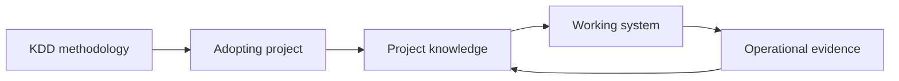

# KDD Scope and Boundaries

**Status:** Accepted  
**Version:** 0.1  
**Project:** Knowledge-Driven Development  
**Accepted:** 2026-07-18  
**Accepted by:** Krzysztof Olejnik — KDD Methodology Owner  

## 1. Purpose

This document defines what Knowledge-Driven Development (KDD) is, what problems it addresses, where its responsibility begins and ends, and what it deliberately does not prescribe.

It establishes the boundary within which the methodology, its knowledge architecture, processes, roles, practices, and conformance rules may evolve.

## 2. Definition

Knowledge-Driven Development is an open, universal methodology for developing software systems through collaboration between people and AI.

KDD organizes the creation, validation, use, and evolution of:

- product and business knowledge,
- decisions and their rationale,
- domain models and requirements,
- architecture and contracts,
- implementation guidance,
- verification evidence,
- operational knowledge and feedback.

Its purpose is to lead a project from product vision to a working and evolving system while preserving the context needed to understand why the system exists, how it should behave, and why it was built in a particular way.

KDD is independent of:

- programming language,
- application framework,
- architectural style,
- project-management tool,
- repository platform,
- AI model or provider,
- deployment model,
- organization size.

## 3. Problem Addressed by KDD

Modern teams can produce code faster than they can build, validate, and retain shared understanding.

AI increases this imbalance. It can accelerate analysis, design, implementation, and review, but it can also amplify weak assumptions and create plausible outputs without sufficient project context.

Common failure modes include:

- code being produced before the product problem is understood,
- business intent being lost between vision, requirements, architecture, and implementation,
- decisions remaining only in meetings, chats, or individual memory,
- contracts being inferred from code instead of agreed before implementation,
- documentation describing intentions while repository state reflects something else,
- local evidence being generalized beyond its actual scope,
- changes being made without understanding their downstream impact,
- AI making or concealing decisions that require human authority,
- accumulated knowledge becoming difficult to discover, trust, or maintain.

KDD addresses these failures by treating explicit, traceable, and verifiable knowledge as the primary project asset. Code is an important result of that knowledge, but it is not its sole source.

## 4. Mission

The mission of KDD is to make software development:

- intentional,
- knowledge-driven,
- ordered,
- traceable,
- verifiable,
- context-preserving,
- tool-independent,
- proportional to project risk,
- accountable to human decision-makers.

KDD should help a team answer, at any meaningful point in the project:

1. What problem are we solving?
2. What knowledge supports the current direction?
3. Which decisions are authoritative?
4. What contracts must the system satisfy?
5. How does the implementation derive from accepted knowledge?
6. What evidence shows that the intended result was achieved?
7. What knowledge is affected when something changes?

## 5. Intended Audience

KDD is intended for:

- product owners and business stakeholders,
- domain experts,
- software architects,
- developers,
- quality and security specialists,
- operations and platform teams,
- technical writers and knowledge stewards,
- teams using AI assistants in software delivery,
- organizations seeking a repeatable method for human–AI collaboration.

A project may adopt KDD with one person performing several roles. The methodology defines responsibilities and authority, not mandatory job titles or team size.

## 6. Areas Within Scope

### 6.1 Product framing

KDD covers the transformation of an initial idea into an explicit product direction, including:

- vision,
- problem statement,
- stakeholders,
- desired outcomes,
- constraints,
- scope boundaries,
- success criteria,
- significant assumptions and unknowns.

### 6.2 Knowledge management

KDD defines how project knowledge is:

- identified,
- captured,
- structured,
- reviewed,
- accepted,
- superseded,
- archived,
- made discoverable,
- connected through traceability.

This includes artifact types, lifecycle states, authority levels, provenance, ownership, and rules for resolving conflicts.

### 6.3 Domain understanding and requirements

KDD covers the development of shared understanding of the business and problem domain, including:

- terminology,
- domain concepts and rules,
- actors and responsibilities,
- processes and scenarios,
- functional and quality requirements,
- external obligations,
- acceptance criteria.

### 6.4 Architecture and contracts

KDD covers the knowledge required before and during implementation, including:

- architectural drivers,
- system boundaries,
- components and responsibilities,
- significant technical decisions,
- interfaces and data contracts,
- behavioral and quality contracts,
- dependency and integration constraints,
- threat, risk, and failure considerations.

KDD requires business knowledge to inform architecture, architecture to shape implementation, and explicit contracts to precede the code that realizes them whenever the risk and cost justify formalization.

### 6.5 Human–AI collaboration

KDD defines how AI may support:

- exploration and synthesis,
- knowledge extraction,
- gap and contradiction detection,
- option generation,
- impact analysis,
- design and implementation,
- test and review preparation,
- evidence collection,
- knowledge maintenance.

It also defines boundaries for AI participation, including required context, provenance, review, escalation, and human authority.

### 6.6 Delivery and implementation

KDD connects accepted knowledge to executable work by defining:

- readiness conditions,
- implementation context,
- change scope,
- traceability to decisions and contracts,
- proportional quality controls,
- handling of discoveries made during implementation.

KDD does not prescribe a programming technique. It requires implementation work to remain aligned with authoritative knowledge and to feed validated discoveries back into that knowledge.

### 6.7 Verification and evidence

KDD covers the production and evaluation of evidence that a result conforms to accepted knowledge, including:

- reviews,
- tests,
- static and dynamic analysis,
- security and quality checks,
- acceptance evidence,
- limitations and unresolved risks.

Evidence must be interpreted within its actual scope. A passing local check is not automatically proof of system-wide correctness.

### 6.8 Operations and learning

KDD includes the knowledge produced after deployment, including:

- operational constraints,
- observability and service expectations,
- incidents and corrective actions,
- user feedback,
- measured outcomes,
- lessons that change existing assumptions, decisions, or contracts.

A working system is part of the knowledge feedback loop, not the end of knowledge development.

## 7. What KDD Is Not

KDD is not:

- a software framework or programming model,
- a required architectural style,
- a replacement for domain expertise,
- a replacement for product or engineering judgment,
- a task-management method,
- a fixed sequence of ceremonies,
- a prompt library,
- a documentation generator,
- a system for autonomous AI management,
- a guarantee or certificate of software quality,
- a demand to document every thought or implementation detail.

KDD does not equate document volume with knowledge quality. The required rigor and artifact depth must be proportional to uncertainty, risk, reversibility, lifetime, and impact.

## 8. KDD and the Adopting Project

KDD defines a methodology. An adopting project owns its product-specific knowledge and delivery decisions.

KDD may define:

- types of knowledge that should exist,
- lifecycle and authority rules,
- expected relationships between artifacts,
- decision points and quality gates,
- responsibilities of people and AI,
- minimum conformance expectations.

The adopting project determines:

- its product vision and scope,
- its domain model and terminology,
- its requirements and constraints,
- its architecture and contracts,
- its implementation technologies,
- its delivery process and operational environment,
- the proportional depth of each artifact,
- which optional KDD practices it adopts.

Project-specific conclusions must not silently become universal KDD rules. They may inform the methodology only after their applicability has been evaluated beyond the original project context.

## 9. Method and Tool Boundary

KDD describes capabilities, relationships, and decision rules rather than mandating specific tools.

Examples:

| KDD concern | Possible realization |
|---|---|
| Authoritative knowledge | Markdown, wiki, knowledge graph, document system |
| Traceability | Links, identifiers, metadata, repository automation |
| Decisions | ADRs, RFCs, decision records, issue workflows |
| Contracts | Schemas, specifications, tests, formal models |
| Evidence | CI reports, review records, test results, audit artifacts |
| AI support | IDE assistant, chat system, agent workflow, local model |

A tool may automate a KDD practice, but the tool is not the methodology. Switching tools should not invalidate the meaning or authority of project knowledge.

## 10. Human and AI Boundary

AI is a participant in knowledge work, not the final authority for consequential project decisions.

AI may:

- propose,
- analyze,
- compare,
- synthesize,
- implement,
- test,
- review,
- identify uncertainty,
- collect evidence.

AI must not independently:

- define product intent,
- accept business risk,
- approve architecture on behalf of accountable people,
- waive legal, security, quality, or operational obligations,
- declare uncertain knowledge to be fact,
- hide assumptions or provenance,
- convert a proposal into an authoritative decision without human approval.

Humans retain accountability for:

- goals and priorities,
- acceptance of significant assumptions,
- approval of authoritative decisions and contracts,
- risk acceptance,
- conflict resolution,
- release and operational responsibility.

The required level of human review increases with consequence, uncertainty, irreversibility, and scope of impact.

## 11. Relationship to Other Methods

KDD is designed to coexist with established practices and methods.

It may be used with, among others:

- Domain-Driven Design,
- Architecture Decision Records,
- Requests for Comments,
- Test-Driven Development,
- Behavior-Driven Development,
- DevOps and platform engineering,
- continuous delivery,
- Scrum,
- Kanban,
- risk and compliance frameworks.

KDD does not replace these methods. It provides a knowledge architecture and an end-to-end reasoning structure that can connect them.

Where another method defines a specialized practice more deeply, KDD should reference or integrate that practice rather than duplicate it without need.

## 12. Adoption Profiles

KDD must support at least two levels of adoption.

### 12.1 Minimal profile

The minimal profile is suitable for small, low-risk, or exploratory work. It requires enough explicit knowledge to establish:

- purpose and scope,
- key decisions,
- essential contracts,
- implementation traceability,
- verification evidence,
- known limitations and risks.

Artifacts may be concise and responsibilities may be combined.

### 12.2 Extended profile

The extended profile is suitable for long-lived, regulated, distributed, safety-relevant, or otherwise high-risk systems. It may require:

- more formal authority and review,
- stronger provenance,
- broader traceability,
- explicit quality and security models,
- formalized contracts,
- controlled lifecycle transitions,
- durable audit and operational evidence.

Profiles change the degree of rigor, not the foundational principles of KDD.

Detailed profile definitions and conformance levels will be established separately.

## 13. Success Criteria for the Methodology

KDD is successful when an adopting team can:

- understand the product intent without reconstructing it from code,
- distinguish authoritative knowledge from proposals and observations,
- trace important implementation elements to accepted decisions and contracts,
- identify the impact of a proposed change,
- use AI without delegating human accountability,
- detect gaps, contradictions, and stale knowledge early,
- verify outcomes with evidence appropriate to the claim,
- scale rigor to project risk,
- change tools without losing the project’s reasoning structure,
- learn from implementation and operations without erasing prior context.

KDD should reduce avoidable rework caused by missing or inconsistent knowledge. It should not create documentation work whose cost exceeds its decision, coordination, verification, or learning value.

## 14. Origin and Role of KSeF_2

The KSeF_2 project is an important empirical source for KDD. It demonstrates practices and structures from which the methodology is being extracted and generalized.

KSeF_2 is not a normative source for KDD.

Therefore:

- KSeF_2 artifacts may inspire KDD concepts,
- lessons from KSeF_2 should be recorded with provenance,
- project-specific choices must be evaluated before generalization,
- KDD rules must remain applicable beyond KSeF_2,
- future projects may challenge and improve conclusions derived from KSeF_2.

KDD evolves through evidence from multiple projects, deliberate review, and human acceptance.

## 15. Repository Boundary

The KDD repository may contain:

- foundations and principles,
- the knowledge architecture,
- lifecycle and governance rules,
- methodology processes,
- roles and human–AI collaboration rules,
- reusable artifact specifications and templates,
- quality and conformance models,
- examples and reference applications,
- supporting automation that does not redefine the methodology.

Product-specific source code and knowledge belong in the adopting project unless they serve as explicitly labeled examples or reference material.

Normative methodology content must be distinguishable from:

- explanatory guidance,
- examples,
- experiments,
- historical material,
- project-specific evidence.

## 16. Conformance Boundary

A project may claim KDD conformance only against a defined version and profile of the methodology.

Conformance must not be inferred merely from:

- using AI,
- storing documentation with code,
- adopting selected terminology,
- copying KDD templates,
- referencing the KDD repository.

A conformance model must specify:

- mandatory and optional requirements,
- permitted tailoring,
- required evidence,
- profile and version,
- known deviations.

The detailed requirements, profiles, evidence, assessment, and declaration rules are defined in the [KDD Adoption and Conformance Model](../40-adoption/adoption-and-conformance-model.md).

## 17. Scope Change Rule

A proposed addition to KDD belongs within the methodology only when it:

1. addresses knowledge-driven software development across more than one specific project context,
2. preserves human accountability,
3. can be expressed independently of a mandatory technology,
4. fits or intentionally changes the accepted knowledge architecture,
5. has a clear relationship to product outcomes, decisions, contracts, delivery, verification, or learning,
6. does not duplicate a specialized method without adding integration value.

Changes to this boundary require explicit review because they affect the meaning of the entire methodology.
