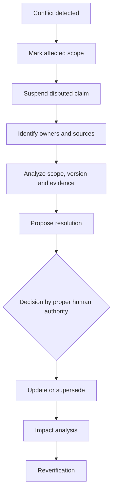

# KGAID Knowledge Authority Model

## 1. Purpose

This document defines who MAY propose, review, accept, realize, verify, change
and retire knowledge in Knowledge-Governed AI-Assisted Development (KGAID). It also defines
source authority, delegation, conflict resolution and the authority boundaries
between humans, AI and automation.

The model is independent of organization size, role names, programming
language, repository host and AI provider. A small project MAY assign several
authorities to one person. A larger or high-risk project MAY separate them.
The semantic responsibilities remain the same.

The fundamental rule is:

> **Authority is always scoped.**

Architecture authority does not grant authority to change a business rule.
Product authority does not replace technical evidence. Implementation
authority does not grant authority to redefine a contract. AI execution
capability does not grant human decision or risk authority.

## 2. Authority responsibilities

| Responsibility | Meaning |
| --- | --- |
| **Knowledge Owner** | Maintains one artifact, its meaning, lifecycle and consistency. |
| **Proposal Authority** | May create and develop a proposal within a declared scope. |
| **Review Authority** | Evaluates correctness within a declared discipline or concern. |
| **Decision Authority** | May make an artifact normative by accepting it. |
| **Implementation Authority** | May realize accepted knowledge within delegated boundaries. |
| **Verification Authority** | Evaluates whether evidence supports the declared claim and scope. |
| **Risk Authority** | May accept residual risk and its consequences. |
| **Baseline Authority** | May establish a knowledge baseline or release claim. |
| **Knowledge Steward** | Maintains knowledge structure, metadata, ownership and traceability rules. |

One person MAY hold several responsibilities, but the record SHOULD identify
the role in which each consequential decision was made.

Authorship and authority are independent. The author of an artifact is not
automatically its owner, reviewer or decision authority.

## 3. Default roles

| Role | Primary responsibility |
| --- | --- |
| **Product Authority** | Product vision, boundaries, outcomes, priorities and capabilities. |
| **Domain Authority** | Domain language, business rules and domain correctness. |
| **Requirements Authority** | Functional and quality requirements and acceptance criteria. |
| **Architecture Authority** | System boundaries, ownership, architecture specifications and ADRs. |
| **Contract Owner** | Meaning, observable semantics, compatibility and lifecycle of a contract. |
| **Security and Compliance Authority** | Security, privacy, legal, regulatory and compliance constraints. |
| **Delivery Authority** | Scope and completion of a delivery increment. |
| **Verification Authority** | Adequacy, reproducibility and interpretation of evidence. |
| **Operations Authority** | Operational behaviour, incidents, measurements and operational learning. |
| **Risk Authority** | Explicit acceptance, transfer, reduction or rejection of risk. |
| **Knowledge Steward** | Knowledge architecture, artifact metadata, ownership and conflict visibility. |
| **AI Collaborator** | Analysis, proposals, implementation, evidence generation and review without acceptance authority. |

Projects MAY use different role names or combine roles. They MUST preserve the
scope and accountability represented by the roles above.

## 4. Default artifact authority

| Artifact | Typical owner | Typical decision authority |
| --- | --- | --- |
| `PRN` | Knowledge Steward | Product or Project Authority |
| `VIS` | Product Authority | Product Authority |
| `TERM`, `BR` | Domain Authority | Domain Authority |
| `ASM` | Owner of the investigated concern | Relevant domain authority |
| `RISK` | Risk owner | Risk Authority |
| `CAP`, `UC` | Product or Domain Authority | Product Authority |
| `SCN` | Capability, Use Case or Verification owner | Relevant Product or Domain Authority |
| `REQ`, `QR` | Requirements Authority | Product or applicable Quality Authority |
| `CON` | Owner of the constraint | Security, Compliance, Product or Architecture Authority |
| `ARC` | Architecture Authority | Architecture Authority |
| `ADR` | Architecture Authority | Authorized human Architecture Decision Authority |
| `CTR` | Contract Owner | Applicable Contract, Architecture and Domain Authorities |
| `RFC` | Proposal author or concern owner | Applicable authority after review |
| `INC` | Delivery Authority | Product or Delivery Authority |
| `EVD` | Verification Authority | Verification Authority or an approved automatic policy |
| `AUD` | Independent reviewer where proportionate | Authority responsible for the audited concern |
| `LRN` | Operations or Knowledge Owner | Owner of the affected normative knowledge |

This is a default model, not a mandatory organization chart. A project MAY
assign different authorities when it records the assignment, preserves the
required competence and does not give AI final human authority.

## 5. Authority classes

| Class | Meaning |
| --- | --- |
| **Binding External** | Applicable law, regulation, signed agreement, mandatory standard or external contract. |
| **Constitutional** | Project manifesto, principles, vision, product boundaries and governance. |
| **Normative** | Accepted domain rules, requirements, architecture and contracts. |
| **Decision** | Accepted ADR or another durable human decision. |
| **Proposed** | RFC, draft or other non-accepted candidate knowledge. |
| **Evidence** | Observation, test result, measurement, audit record or reproducible experiment. |
| **Derived** | Translation, index, generated summary or synchronized representation. |
| **Informative** | Guidance, explanation, example or tutorial. |
| **Implementation** | Code, configuration, migration or another realization of knowledge. |

A Derived, Informative or Implementation artifact cannot change the meaning of
a Normative, Decision or Constitutional artifact.

An Evidence artifact is authoritative only for the observation it actually
records within its scope. It can challenge a claim, but it does not silently
rewrite normative knowledge.

## 6. Knowledge precedence and subject ownership

The general derivation order is:

```text
Binding external obligations
→ project principles and product boundaries
→ domain language and business rules
→ capabilities and requirements
→ architecture and durable decisions
→ contracts
→ implementation
```

This order constrains downstream artifacts, but conflict resolution is not a
simple choice of the highest or newest file. The authoritative artifact for the
specific subject owns its meaning.

Examples:

- an ADR cannot silently change a business rule;
- a test cannot redefine required behaviour;
- a README cannot override architecture;
- code cannot redefine a contract;
- an architect cannot accept legal risk without the relevant authority;
- a product decision cannot claim technical verification without evidence; and
- a newer commit is not automatically more authoritative than an accepted
  artifact.

When a downstream discovery demonstrates that upstream knowledge is wrong or
obsolete, the upstream artifact re-enters the knowledge lifecycle through its
own owner and decision authority.

## 7. Source authority

| Level | Source |
| --- | --- |
| **S0** | Applicable law, signed agreement, mandatory standard or binding external contract. |
| **S1** | Official primary source or specification published by the system owner. |
| **S2** | Accepted project artifact that owns the relevant meaning. |
| **S3** | Direct observation, reproducible measurement or controlled experiment. |
| **S4** | Credible secondary source. |
| **S5** | Inference, interpretation, expert opinion or recommendation. |
| **S6** | Unverified note, conversation or AI output. |

Source level alone does not determine applicability. Every material source MUST
also be evaluated for:

- scope;
- version;
- effective date and current validity;
- environment;
- jurisdiction;
- authenticity;
- whether it is normative, informative or evidential; and
- relevance to the exact claim.

A lower-level reproducible observation MAY reveal that an official
specification and a running external system differ. The observation does not
silently replace the specification. The conflict is recorded, scoped and
resolved by the relevant authority.

## 8. Knowledge conflicts

### 8.1 Conflict types

| Conflict | Example |
| --- | --- |
| **Ownership Conflict** | Two artifacts claim authority over the same definition. |
| **Normative Conflict** | Two accepted artifacts require incompatible behaviour. |
| **Source Conflict** | Applicable credible sources contain different claims. |
| **Evidence Conflict** | Reproducible tests or observations produce inconsistent results. |
| **Version Conflict** | Artifacts refer to incompatible versions of a contract or system. |
| **Authority Conflict** | An artifact was accepted by a role outside its authority. |
| **Scope Conflict** | Evidence from a bounded environment is generalized to a wider claim. |
| **Status Conflict** | Different documents assign different status to the same authoritative artifact. |

### 8.2 Resolution process



The process is:

1. record the conflict and the affected artifacts;
2. prevent the disputed claim from being used as settled knowledge in the
   affected scope;
3. identify each artifact owner, source, version and decision authority;
4. compare scope, meaning, evidence and applicability;
5. prepare a resolution proposal;
6. obtain the decision of the authority that owns the disputed subject;
7. update, reject, retire or supersede the affected artifacts;
8. perform downstream impact analysis; and
9. invalidate or refresh affected evidence.

Until resolution, an artifact MAY retain a `conflicts_with` relationship and a
blocking condition for the affected scope. Unrelated work need not stop.

AI MUST NOT hide a conflict by merging contradictory claims into ambiguous
wording or choosing one source without reporting the unresolved difference.

## 9. Delegation

A human authority MAY delegate actions to another human, team, automation or AI
within an explicit boundary.

Example:

```yaml
delegation:
  delegated_by: architecture-authority
  delegate: implementation-agent

  scope:
    - CTR-004
    - INC-012

  allowed_actions:
    - edit-code
    - add-tests
    - update-derived-documentation

  forbidden_actions:
    - change-contract-semantics
    - accept-risk
    - change-architecture

  valid_until: YYYY-MM-DD
  revocable: true
```

A valid delegation:

- identifies the delegating authority;
- defines scope and allowed actions;
- states constraints and prohibited actions;
- is time-bounded or explicitly revocable;
- cannot expand by implication;
- preserves auditability; and
- does not transfer final product or risk accountability to AI.

A delegate MAY make routine decisions necessary to perform the allowed work
when those decisions remain reversible and inside accepted knowledge.

## 10. Automatic verification authority

Automation MAY update verification status only when authorized humans have
previously accepted:

- the exact claim;
- success and failure criteria;
- the test or verification procedure;
- environment and boundary;
- required tool or implementation of the procedure;
- evidence retention;
- interpretation of the result; and
- conditions that invalidate the policy.

Example:

```text
Human decision:
"CTR-006 is verified when the accepted contract suite passes against the
declared implementation and environment."

Automation:
runs the accepted suite, records its version and result, creates EVD evidence,
and applies the approved verification status.
```

Automation confirms the pre-authorized criterion. It does not broaden a unit
test into an integration, security, regulatory, restart-durability or
production-readiness claim.

A policy change that alters claim meaning or evidence scope requires new human
acceptance.

## 11. Separation of duties

For high-risk, regulated, security-sensitive or production-critical work, KGAID
recommends proportionate separation:

- proposal author and final acceptor are different;
- implementer is not the only reviewer;
- claim owner is not the only evaluator of evidence;
- risk is accepted by a person accountable for its consequences;
- security and compliance changes receive specialist review; and
- baseline or release approval includes independent verification where
  required.

A small project MAY assign all roles to one person. The decision record SHOULD
still identify which authority that person exercised at each stage.

Separation of duties is a risk control, not mandatory ceremony for every
change.

## 12. AI autonomy boundary

AI MAY autonomously:

- read accepted project knowledge;
- inspect relevant sources;
- distinguish facts, assumptions and recommendations;
- detect contradictions and missing links;
- create and revise proposals;
- present alternatives and consequences;
- implement accepted contracts;
- make local, reversible implementation choices within accepted boundaries;
- run authorized checks;
- create bounded evidence;
- update derived artifacts from their authoritative source; and
- recommend status transitions.

AI MUST obtain human authority before:

- changing product vision or boundaries;
- changing a domain or business rule;
- accepting a requirement;
- changing contract semantics;
- making or superseding a durable architecture decision;
- weakening security, privacy or compliance;
- introducing or accepting an incompatible change;
- broadening the scope of evidence;
- accepting residual risk;
- establishing a normative knowledge baseline; or
- accepting its own proposal.

AI MAY be an author, analyst, implementer or reviewer. It cannot be the final
human decision authority, final risk authority or accountable product owner.

## 13. Knowledge gate authority

| Gate | Required authority |
| --- | --- |
| `KG-1 Proposal Ready` | Knowledge Owner. |
| `KG-2 Decision Ready` | Applicable Review Authorities. |
| `KG-3 Accepted Knowledge` | Decision Authority for the artifact's subject. |
| `KG-4 Realization Ready` | Applicable Requirements, Architecture and Contract Authorities. |
| `KG-5 Implementation Complete` | Delivery Authority. |
| `KG-6 Claim Verified` | Verification Authority or an accepted automatic verification policy. |
| `KG-7 Baseline Ready` | Product or Baseline Authority and Risk Authority where residual risk remains. |
| `KG-8 Learning Reviewed` | Owner of the normative knowledge affected by the learning. |

A gate MAY require several authorities when it crosses product, domain,
architecture, security or compliance boundaries. One authority cannot silently
stand in for another outside its declared scope.

## 14. Minimum authority record

A consequential accepted artifact SHOULD record:

```yaml
authority:
  owner: architecture-authority
  decision_authority: project-owner
  reviewers:
    - domain-authority
    - security-authority

decision:
  knowledge_status: accepted
  accepted_by: person-or-role
  accepted_at: YYYY-MM-DD

  scope:
    - component-a
    - contract-b

  accepted_risks:
    - RISK-004
```

Role names are local to the project. Their scope, competence, decision and
accountability are the required semantics.

## 15. KSeF_2 example

The development of KSeF_2 demonstrates one practical authority allocation:

```text
Human
→ determines product direction and accepts consequential decisions

ChatGPT
→ analyzes requirements, proposes solutions and reviews risk

CODEX
→ realizes accepted scope, executes tests and reports evidence

ADR
→ becomes accepted only after a human decision

Tests and reports
→ verify a declared implementation boundary

Push or release
→ requires separate authority where project governance requires it
```

KGAID generalizes this pattern. It does not require these specific AI products,
tools or role names. It requires human ownership of normative decisions and
risk, explicit delegated execution scope, and bounded evidence.

## 16. Conformance

A project conforms to this authority model when:

- every normative artifact has one accountable owner;
- every acceptance is made by an authority responsible for the subject;
- authority assignments have explicit scope;
- authorship is not confused with acceptance;
- AI does not accept its own proposals or project risk;
- source applicability, version and date are evaluated;
- knowledge conflicts remain visible until formally resolved;
- derived documents and implementation do not override normative artifacts;
- evidence is not generalized beyond its boundary;
- delegation is explicit, limited and revocable;
- automatic verification follows a human-accepted policy;
- consequential decisions preserve their acceptance record; and
- supersession and conflict resolution preserve history.

Conformance does not require a specific organization chart, approval tool,
repository platform, programming language or AI provider.
