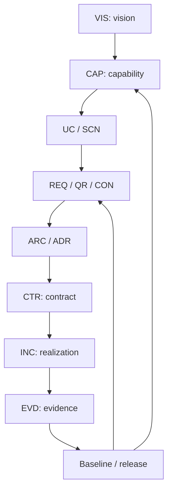
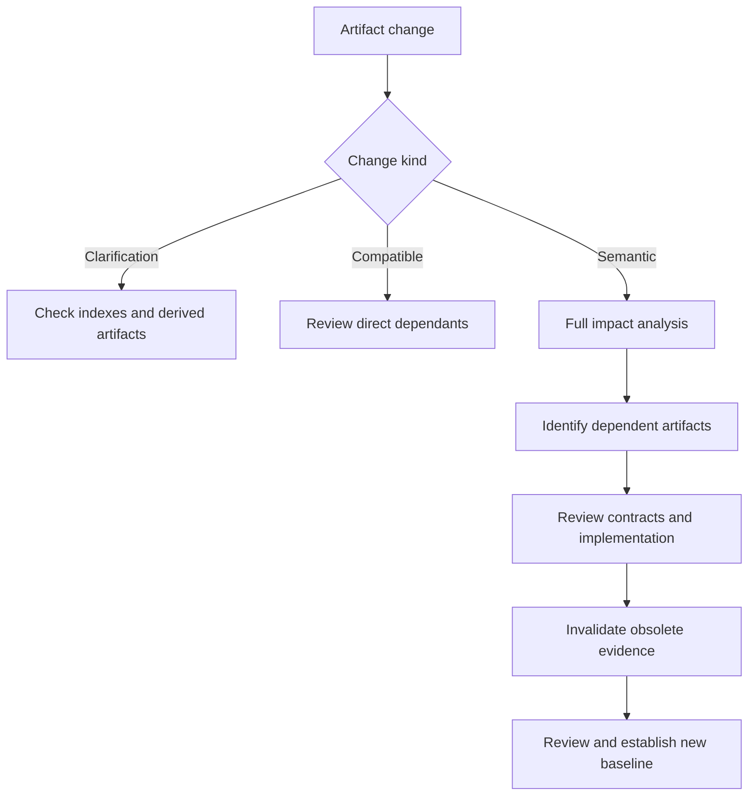

# KGAID Knowledge Traceability Model

## 1. Purpose

This document defines how Knowledge-Governed AI-Assisted Development (KGAID) connects product
vision, domain knowledge, capabilities, requirements, decisions, architecture,
contracts, implementation and evidence.

Traceability MUST make it possible to answer:

- why a decision exists;
- which requirement a contract satisfies;
- which implementation realizes a contract;
- which evidence supports an exact claim;
- which artifacts are affected by a change; and
- whether a baseline or release claim is reproducible.

The fundamental rule is:

> Every consequential product claim SHOULD have a traceable path from purpose
> and accepted knowledge to bounded evidence.

## 2. Primary traceability chain



Not every artifact requires every element in this chain. A consequential
completion, conformance or readiness claim MUST NOT rely solely on the
existence of code.

## 3. Traceability principles

1. Artifacts use stable identifiers rather than file paths as their identity.
2. Relationships are typed; an unqualified Markdown link does not define
   semantic traceability.
3. The downstream artifact stores the reference to the upstream knowledge from
   which it is derived.
4. Inverse relationships are derived and are not maintained manually.
5. Every artifact remains the sole owner of its own status and meaning.
6. Evidence references exact claims, versions and scopes.
7. An implementation references the accepted contracts, requirements or
   architecture that it realizes.
8. A semantic upstream change triggers proportionate impact analysis.
9. A dependency on superseded knowledge is historical unless an explicit
   compatibility or migration period remains active.
10. The number of links is not a quality measure. Every relationship MUST have
    real project meaning.
11. A traceability graph explains derivation and evidence; it does not replace
    human review or authority.
12. Missing or broken traceability is reported explicitly and is never repaired
    by inventing semantic links.

## 4. Authoritative relationship direction

Relationships are recorded from the artifact created later in the knowledge
flow to the upstream knowledge on which it depends.

Example:

```yaml
id: REQ-004

depends_on:
  - CAP-002
  - BR-007
```

The project does not manually add the following inverse list to `CAP-002`:

```yaml
downstream:
  - REQ-004
```

The inverse relationship is calculated from the graph.

This rule prevents two sources from maintaining the same relation and follows
the Single Knowledge Ownership Principle in the
[KGAID Artifact Model](12-artifact-model.md).

## 5. Relationship semantics

| Relationship | Stored direction | Meaning |
| --- | --- | --- |
| `depends_on` | downstream → upstream | The artifact requires the referenced knowledge. |
| `satisfies` | solution → need | The artifact satisfies a requirement, capability or constraint. |
| `realizes` | realization → specification | An increment or implementation realizes architecture or a contract. |
| `constrained_by` | artifact → constraint | The artifact is limited by the referenced constraint. |
| `derived_from` | derivative → source | A non-authoritative artifact is derived from its source. |
| `supersedes` | new → previous | The new artifact replaces the previous artifact. |
| `verified_claims` | evidence → claim | Evidence verifies the exact referenced claims. |
| `conflicts_with` | symmetric conflict | Artifacts contain an unresolved contradiction. |
| `defines` | owner → defined item | The artifact is the authoritative owner of a definition. |

`verified_by` is the derived inverse of `EVD.verified_claims`. It SHOULD NOT
be repeated manually in every requirement and contract.

A symmetric `conflicts_with` relation MAY be stored once in a conflict record
or in one canonical location. Tools MUST expose it in both directions without
creating two independent sources.

## 6. Typical relationship expectations

| Artifact | Typical upstream or related knowledge |
| --- | --- |
| `BR` | `TERM`, domain model and applicable source of obligation. |
| `CAP` | `VIS`, `BR` and applicable `CON`. |
| `UC` | `CAP`, `TERM` and `BR`. |
| `SCN` | `UC`, `REQ` and acceptance criteria. |
| `REQ` | `CAP`, `UC`, `BR` and `CON`. |
| `QR` | `VIS`, `CAP`, `CON` and risks. |
| `ARC` | `REQ`, `QR`, `CON` and `PRN`. |
| `ADR` | Problem, requirements, applicable `BR`, constraints and previous decisions. |
| `CTR` | `ARC`, `ADR`, `REQ` and `QR`. |
| `RFC` | Requirements, risks, decisions and unresolved questions. |
| `INC` | `REQ`, `CTR`, `ADR` and scenarios. |
| `EVD` | Exact claims in `REQ`, `QR`, `CTR` and `INC`. |
| `AUD` | Artifacts and baseline included in the audit scope. |
| `LRN` | Evidence, incidents or observations from which the learning follows. |

This table does not require every possible relationship. Projects maintain the
relationships needed to justify decisions, implementation and claims without
creating administrative link noise.

### 6.1 Business Rule traceability

`BR` is a first-class traceability target. Relationships retain the standard
downstream-to-upstream direction and are recorded only when they have material
meaning:

```text
CAP → BR       capability operates under a rule
Domain Model → BR
               valid domain state or transition is constrained by a rule
REQ → BR       system obligation derives from a rule
ADR → BR       architecture decision is affected by a rule
Test / EVD → REQ
               evidence verifies the requirement claim, not the rule by itself
```

The domain model MAY also be upstream vocabulary for the `BR`; the applicable
relationship direction follows the dependency being recorded. A `REQ` does not
need a `BR` link unless the rule satisfies the Business Rule qualification
criteria in the [Artifact Model](12-artifact-model.md#42-business-rule-qualification).

## 7. Minimum traceability records

### 7.1 Business Rule

```yaml
id: BR-007
type: business-rule
knowledge_status: accepted

depends_on:
  - TERM-012

sources_of_obligation:
  - kind: external-specification
    reference: authoritative-specification@version
```

### 7.2 Requirement

```yaml
id: REQ-004
type: requirement
knowledge_status: accepted

depends_on:
  - CAP-002
  - BR-007

constrained_by:
  - CON-003
```

### 7.3 Contract

```yaml
id: CTR-006
type: contract
knowledge_status: accepted
implementation_status: partial

depends_on:
  - ADR-008
  - REQ-004
  - QR-002

satisfies:
  - REQ-004

constrained_by:
  - CON-003
```

### 7.4 Implementation increment

```yaml
id: INC-012
type: increment
implementation_status: implemented

depends_on:
  - SCN-018

realizes:
  - CTR-006
  - ADR-008

implementation_ref:
  repository: owner/project
  commit: exact-commit-sha
  paths:
    - src/component
```

### 7.5 Evidence

```yaml
id: EVD-014
type: evidence
verification_status: verified

verified_claims:
  - artifact: CTR-006
    claim: idempotent request handling
  - artifact: REQ-004
    claim: repeated execution produces no duplicate effect

subject:
  increment: INC-012
  commit: exact-commit-sha

scope:
  environment: controlled-demo
  boundary: in-memory-provider

limitations:
  - no process-restart verification
  - no production provider
```

The serialization is replaceable. The identifiers, direction, meaning and scope
are normative.

## 8. Claim-level traceability

A reference to a whole document MAY be too broad. Evidence SHOULD identify:

- artifact identifier;
- exact claim or stable section;
- claim version;
- subject version;
- result;
- environment and boundary; and
- limitations.

Example:

```yaml
verified_claims:
  - artifact: CTR-006
    section: submission-idempotency
    claim_version: 1.2
    result: passed
```

This record does not verify every statement in `CTR-006`. It verifies only the
declared claim and scope.

Where a document contains several independently meaningful claims, those claims
MUST be addressable by stable identifiers or anchors. Paragraph numbering alone
is insufficient when formatting changes can move the paragraph.

## 9. Completeness rules

### 9.1 Root artifacts

`PRN`, `VIS` and binding external `CON` artifacts MAY be graph roots and
need not have upstream project dependencies.

### 9.2 Normative artifacts

An accepted downstream artifact SHOULD reference accepted upstream knowledge or
an explicit applicable external source. A deliberate exception MUST record its
owner, scope and rationale.

A proposal MAY depend on another proposal. It cannot use that dependency to
claim accepted downstream knowledge.

### 9.3 Implementation

The status `implemented` requires:

- references to the knowledge being realized;
- an exact implementation reference;
- proportionate evidence;
- no unresolved blocking conflict in the claimed scope; and
- implementation at the intended boundary.

Related code without these properties does not establish implementation of the
artifact.

### 9.4 Verification

The status `verified` requires:

- an existing `EVD`;
- matching claim and subject versions;
- applicable environment and boundary;
- evidence that is not invalidated;
- accepted success criteria; and
- a result that satisfies those criteria.

Evidence cannot verify a version created after the evidence was obtained.

### 9.5 Supersession

Active knowledge SHOULD NOT depend on a `superseded` artifact unless:

- an explicit migration period remains active;
- compatibility is deliberately retained; or
- the relationship is historical and cannot affect current behaviour.

A current dependency MUST name the applicable contract version or replacement.

### 9.6 Conflicts

An unresolved `conflicts_with` relation blocks a baseline or completion claim
within the affected scope unless the responsible human authority explicitly
records a bounded exception and accepted risk.

## 10. Orphan artifacts

An artifact is a candidate orphan when it:

- has no justified place in the graph;
- does not identify the knowledge from which it follows;
- is not used by any current or historical knowledge;
- claims a status unsupported by realization or evidence; or
- contains normative meaning without an owner.

A root principle, vision, external constraint, captured observation or retained
historical decision MAY legitimately have no incoming or outgoing relation.
Automated tools and AI identify candidates; a human Knowledge Owner or Steward
decides whether an artifact is truly orphaned, requires linking, or SHOULD be
retired.

An orphan check MUST NOT create meaningless links merely to satisfy a metric.

## 11. Change impact analysis



Impact analysis covers:

1. the changed artifact and its previous revision;
2. direct inverse relationships calculated from the graph;
3. transitive dependencies through contracts, implementation, evidence and
   baselines;
4. version compatibility;
5. security, legal and operational constraints;
6. risks and accepted exceptions;
7. evidence validity; and
8. migration or coexistence requirements.

Dependent artifacts do not automatically change their knowledge status. The
graph MAY calculate derived traceability health:

- `current`;
- `impact-review-required`;
- `broken`;
- `conflicted`; or
- `historical`.

Traceability health is a calculated validation result, not a fourth manually
maintained status dimension.

## 12. Evidence invalidation

Evidence is marked `invalidated` when:

- the verified claim changed semantically;
- the implementation changed within the verified boundary;
- the environment no longer matches the declared scope;
- the verification procedure was found to be incorrect;
- input data or fixtures were invalid;
- a required dependency was superseded incompatibly;
- the tool or policy interpretation changed materially; or
- a conflict undermines the result.

Not every code change invalidates every evidence artifact. Impact analysis
limits invalidation to the affected claims, subject versions and boundaries.

Historical evidence remains retained with its original result and invalidation
reason. It MUST NOT be reused for a new baseline as if still current.

## 13. Knowledge baseline

A Knowledge Baseline is a versioned reference point containing:

- accepted artifacts and exact revisions;
- relationships between them;
- implementation version or immutable reference;
- applicable non-invalidated evidence;
- known limitations;
- accepted residual risks; and
- explicit unresolved exceptions where the baseline permits them.

A baseline SHOULD be bound to an immutable identifier, such as:

- repository tag;
- exact commit;
- signed manifest; or
- release version.

Later file changes do not alter the historical baseline.

A baseline establishes reproducibility for a declared scope. It does not imply
that every planned capability is complete or that production readiness has been
verified.

## 14. Cross-repository traceability

KGAID is intended for use by multiple independent projects. An identifier such as
`ADR-001` is therefore ambiguous outside its project namespace.

A cross-project reference SHOULD include:

```yaml
target:
  project: KSeF_2
  artifact: ADR-023
  repository: KrzysztofOle/KSeF_2
  revision: exact-tag-or-commit
```

A compact representation MAY be used:

```text
ksef2:ADR-023@v0.10.1
kgaid:PRN-001@0.1
```

The project namespace, artifact identifier and revision form the semantic
reference. A repository URL is a locator, not the identity of the knowledge.

Cross-repository references SHOULD be pinned to a tag, commit or immutable
release when reproducibility matters. A floating reference to a default branch
is informative unless its volatility is explicitly accepted.

## 15. Traceability to code

KGAID does not require a requirement identifier in every function or source file.
The implementation relationship MAY be maintained at the level of:

- `INC`;
- component or module;
- contract test;
- pull request;
- commit;
- migration;
- deployment manifest; or
- release manifest.

Direct identifiers in source code are useful only when they maintain a
meaningful dependency and do not create noise or stale comments.

The minimum reproducible path is:

```text
INC
→ exact implementation revision
→ realized CTR / REQ / ADR
→ applicable EVD
```

A branch name, mutable issue description or current working tree is not an
immutable implementation reference.

## 16. Negative knowledge traceability

Traceability includes negative knowledge:

- non-goals;
- forbidden dependencies;
- intentionally excluded behaviour;
- security prohibitions;
- guarantees explicitly not provided;
- deferred capabilities; and
- prohibited data ownership.

Example:

```yaml
id: EVD-020

verified_claims:
  - artifact: ADR-008
    claim: core has no ERP-specific dependency

verification_method:
  - architecture dependency test
```

Evidence that a forbidden dependency is absent MAY be as important as evidence
that a capability works.

A negative claim MUST state its inspection boundary. A test of one package
cannot prove absence across an uninspected repository or deployed system.

## 17. Traceability profiles

### 17.1 Minimal profile

A conforming minimal project maintains at least:

- a requirement linked to a capability or purpose;
- a consequential decision linked to a requirement, constraint or problem;
- a material contract linked to architecture or a requirement;
- an increment linked to the contract or requirement it realizes; and
- evidence linked to the exact claim and implementation version.

Artifacts MAY be grouped in a small number of files.

### 17.2 Extended profile

A larger, regulated, multi-repository or long-lived project SHOULD additionally
maintain:

- complete assumption and risk relationships;
- quality and external-constraint traceability;
- cross-repository references;
- compatibility and migration links;
- automated orphan detection;
- transitive impact analysis;
- evidence invalidation;
- a versioned baseline manifest; and
- conformance and traceability reports.

## 18. Automation

Automation MAY:

- validate identifier syntax and uniqueness;
- check whether relation targets exist;
- calculate inverse relationships;
- detect duplicate knowledge owners;
- detect dependencies on superseded artifacts;
- detect version mismatches;
- identify orphan candidates;
- calculate traceability health;
- generate indexes and relationship views;
- produce impact reports;
- invalidate evidence under an accepted deterministic policy; and
- validate baseline completeness.

Automation MUST NOT:

- invent semantic meaning for a relationship;
- treat an incidental hyperlink as a dependency;
- claim evidence is sufficient for a broader assertion;
- resolve a knowledge conflict;
- silently change the owner of normative knowledge;
- accept project risk; or
- create an accepted normative relationship without human authority.

AI MAY recommend missing relationships and explain their likely meaning. A
material semantic relationship remains a proposal until reviewed according to
the Knowledge Lifecycle and Authority Model.

## 19. Metrics

Useful health metrics include:

- requirements linked to an upstream capability or purpose;
- accepted contracts linked to requirements and architecture;
- implemented increments with immutable implementation references;
- implemented increments with current evidence;
- verified claims backed by non-invalidated evidence;
- dependencies on superseded artifacts;
- artifacts requiring impact review;
- unresolved conflicts;
- orphan candidates; and
- baseline items with version mismatch.

Projects SHOULD NOT optimize raw link count or require artificial 100% coverage
of every file. Metrics support investigation and governance; they do not replace
semantic review.

## 20. KSeF_2 examples

### 20.1 ERP-independent Core

```text
VIS: vendor-neutral KSeF communication library
→ PRN / BR: no ERP dependency in the Core
→ ADR-008: Core remains ERP-independent
→ ARC: External Connector remains outside the Core
→ CTR: connector implements Core-owned Port Contracts
→ INC: extraction of ksef-optima-connector
→ EVD: architecture dependency protection test
→ AUD: architecture review after migration
```

### 20.2 Durable UC-005 foundation

```text
Need for durable UC-005 execution
→ RFC-0008
→ ADR-022 / ADR-023
→ Coordinator and Storage contracts
→ in-memory foundation implementation
→ contract and unit tests
→ evidence bounded to one process
→ no evidence for restart durability
```

The second chain demonstrates why accepted knowledge, implementation maturity
and verification status remain independent. The existence of tested in-memory
contracts does not establish a production-durable Storage implementation.

## 21. Conformance

A project conforms to this traceability model when:

- normative artifacts use stable identifiers;
- material relationships have explicit types and direction;
- authoritative relationships are maintained in one direction;
- inverse views are derived;
- implementation claims reference accepted knowledge and immutable realization;
- evidence references exact claims, versions, environments and boundaries;
- semantic changes trigger proportionate impact analysis;
- invalidated evidence cannot support a current baseline;
- superseded knowledge is not used unknowingly;
- unresolved conflicts remain visible;
- cross-repository references are namespaced and versioned where required;
- baselines are reproducible; and
- AI and automation do not independently create normative meaning.

Conformance does not require a specific graph database, schema language,
repository platform, programming language, workflow tool or AI provider.
