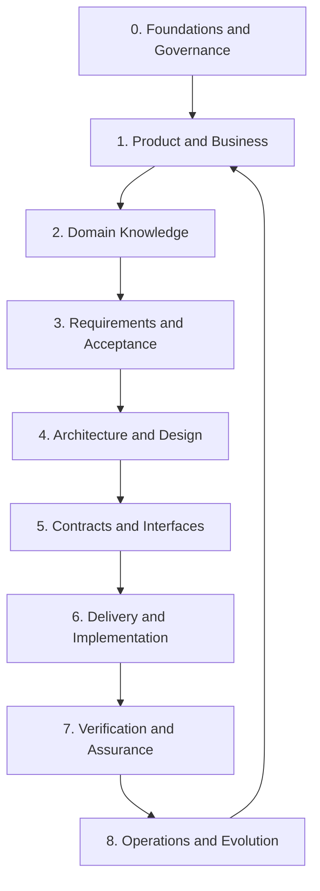

# KGAID Knowledge Domains Model

## 1. Purpose

This document defines the semantic domains of knowledge used by
Knowledge-Governed AI-Assisted Development (KGAID). Each domain answers a distinct class of
questions, owns a distinct meaning and has an accountable authority.

A knowledge domain is not necessarily a directory, phase, team or document.
It is a responsibility boundary. A small project MAY store several domains in
one file, while a large project MAY use separate repositories. The semantic
separation MUST remain visible in both cases.

KGAID preserves the derivation order:

> Product and business knowledge precede architecture. Architecture precedes
> contracts. Contracts precede implementation. Evidence supports claims about
> the realization but does not become their normative source.

## 2. Domain overview



The downward flow represents derivation. The return from Operations and
Evolution to Product and Business starts a new knowledge lifecycle. It does not
silently modify accepted upstream artifacts.

Multiple capabilities MAY move through these domains concurrently. KGAID is not a
requirement to complete every product artifact before implementation begins.
The selected increment MUST have sufficient accepted upstream knowledge.

## 3. Domain 0 — Foundations and Governance

### 3.1 Questions

This domain answers:

- Which principles govern the project?
- Who owns and accepts knowledge?
- How is knowledge created, changed and retired?
- What authority boundaries apply to humans, AI and automation?
- Which KGAID profile and governance rules does the project use?
- How are versions, baselines and risks governed?

### 3.2 Typical knowledge

- manifesto;
- `PRN` artifacts;
- project governance;
- selected KGAID profile;
- knowledge architecture;
- lifecycle and authority rules;
- versioning and baseline rules;
- working safety constraints;
- AI collaboration and delegation rules.

### 3.3 Excludes

This domain does not define:

- product capabilities;
- business-domain meaning;
- solution architecture;
- implementation technology;
- product-specific contract semantics; or
- evidence that a product capability works.

### 3.4 Authority

Typical owner: Project Authority or Knowledge Steward.

A Foundations decision constrains the process and knowledge system. It cannot
replace the Product, Domain, Requirements, Architecture or Verification
authorities in their subject areas.

## 4. Domain 1 — Product and Business

### 4.1 Questions

This domain answers:

- Why does the product exist?
- Which problem does it solve?
- For whom?
- Which outcomes and value SHOULD it provide?
- What is the product and what is it not?
- Where are its scope and responsibility boundaries?
- Which business or user capabilities does it expose?
- How will product success be recognized?

### 4.2 Typical knowledge

- `VIS`;
- `CAP`;
- stakeholders and actors;
- problem statements;
- product outcomes and measures;
- value proposition;
- scope and non-goals;
- product context;
- business constraints;
- product ownership boundaries.

### 4.3 Excludes

This domain does not choose:

- framework or programming language;
- database schema;
- component design;
- endpoint shape;
- class structure;
- infrastructure topology; or
- implementation algorithm.

A solution choice MAY appear here only when it is itself a binding product or
business constraint and is recorded as such.

### 4.4 Authority

Typical owner: Product Authority.

## 5. Domain 2 — Domain Knowledge

### 5.1 Questions

This domain answers:

- How does the represented reality work?
- Which terms and meanings are canonical?
- Which business rules and invariants apply?
- Which actors, entities, values and processes exist?
- Who owns business data and state?
- Where are the domain boundaries?
- Which distinctions MUST remain stable independently of technology?

### 5.2 Typical knowledge

- `TERM`;
- `BR`;
- domain model;
- business processes;
- domain invariants;
- ownership of data and state;
- domain boundaries;
- business classifications;
- definitions of business events;
- domain examples and counterexamples.

### 5.3 Excludes

This domain does not define:

- database tables or schemas;
- transport DTOs;
- framework types;
- source-code classes;
- screens;
- network protocols;
- serialization libraries; or
- implementation repositories.

A domain model MAY later be represented in code, but its normative meaning does
not originate in that representation.

### 5.4 Authority

Typical owner: Domain Authority.

## 6. Domain 3 — Requirements and Acceptance

### 6.1 Questions

This domain answers:

- What MUST the system provide?
- Which observable behaviour is required?
- What are the success, failure and boundary conditions?
- Which quality attributes and constraints apply?
- Which scenarios MUST be supported?
- How will an acceptable result be recognized?
- Which behaviour is prohibited or intentionally excluded?

### 6.2 Typical knowledge

- `UC`;
- `SCN`;
- `REQ`;
- `QR`;
- acceptance criteria;
- failure and edge cases;
- business-facing security requirements;
- compatibility requirements;
- external and internal `CON` artifacts;
- required negative behaviour.

### 6.3 Excludes

This domain does not define:

- component decomposition;
- API or Port shape;
- database schema;
- concrete framework;
- source-code organization; or
- an algorithm unless that algorithm is itself an externally required
  behaviour.

Requirements describe obligations and expected results, not accidental
properties of the current implementation.

### 6.4 Authority

Typical owner: Requirements Authority, working with Product and Domain
Authorities.

## 7. Domain 4 — Architecture and Design

### 7.1 Questions

This domain answers:

- How is the system structurally divided?
- Which component owns each responsibility and state?
- Which boundaries and dependency directions apply?
- Which architectural qualities does the structure support?
- Which security, reliability and isolation boundaries exist?
- Which durable solution decisions were made?
- Which implementation choices are architecture-significant?

### 7.2 Typical knowledge

- `ARC`;
- `ADR`;
- architecture views;
- subsystem and component ownership;
- allowed and forbidden dependencies;
- state ownership;
- security boundaries;
- reliability and recovery strategies;
- architecture-significant technology decisions;
- architecture principles specific to the product.

### 7.3 Excludes

This domain does not:

- create new business rules;
- silently modify accepted requirements;
- treat current code layout as automatically normative;
- contain every local implementation choice; or
- replace observable contracts.

Architecture explains structural realization of accepted needs. It does not
retroactively invent those needs.

### 7.4 Authority

Typical owner: Architecture Authority.

## 8. Domain 5 — Contracts and Interfaces

### 8.1 Questions

This domain answers:

- How do components, systems or actors collaborate across a boundary?
- Which behaviour is observable?
- What are the inputs, outputs, outcomes and errors?
- Which guarantees apply?
- Who owns the contract?
- How do versioning, compatibility and deprecation work?
- Which different implementations MAY realize the contract?

### 8.2 Typical knowledge

- `CTR`;
- public API contracts;
- Port contracts;
- event contracts;
- data exchange contracts;
- error semantics;
- idempotency and ordering guarantees;
- compatibility and migration rules;
- contract test specification;
- protocol-independent business contract semantics.

### 8.3 Excludes

This domain does not define:

- one concrete implementation;
- hidden behaviour inferred only from current code;
- external-system details that are not part of the accepted boundary;
- database layout merely because one implementation uses it; or
- a new business rule without Domain and Requirements authority.

A contract MAY use technology-specific representation when the representation
is intentionally part of the accepted boundary. The representation and its
compatibility consequences MUST then be explicit.

### 8.4 Authority

Typical owner: Contract Owner, with applicable Domain, Requirements,
Architecture, Security and Compatibility authorities.

## 9. Domain 6 — Delivery and Implementation

### 9.1 Questions

This domain answers:

- Which bounded increment is being realized?
- Which requirements, decisions and contracts does it realize?
- Where is the implementation?
- What is its implementation status?
- Which configuration, migration and packaging are required?
- Which implementation constraints were discovered?
- Which local technical choices remain inside delegated authority?

### 9.2 Typical knowledge and artifacts

- `INC`;
- source code;
- configuration;
- migrations;
- packages;
- immutable commits;
- pull requests;
- deployment definitions;
- implementation plans;
- technical notes;
- reversible local implementation decisions.

### 9.3 Excludes

This domain MUST NOT:

- silently change requirements;
- change contract semantics without authority;
- make hidden architecture decisions;
- claim conformance without evidence;
- treat current implementation as the owner of business meaning; or
- hide a discovered upstream conflict inside code.

An implementation discovery that changes scope or meaning re-enters the
Knowledge Lifecycle as a proposal.

### 9.4 Authority

Typical owner: Delivery Authority.

## 10. Domain 7 — Verification and Assurance

### 10.1 Questions

This domain answers:

- What was verified?
- Which exact claim does the evidence support?
- Which version and environment were exercised?
- What was the result?
- Which guarantees were not tested?
- Does the realization conform to accepted knowledge?
- Can a baseline or release claim be established?

### 10.2 Typical knowledge

- `EVD`;
- `AUD`;
- test results;
- contract tests;
- integration and system evidence;
- security and compliance reports;
- DEMO and end-to-end reports;
- coverage reports;
- architecture tests;
- compatibility verification;
- baseline manifest;
- verification limitations.

### 10.3 Excludes

This domain MUST NOT:

- change a requirement to fit a test result;
- generalize evidence beyond its scope;
- accept product or regulatory risk without authority;
- suppress failed or conflicting results;
- claim production readiness from an unrelated test boundary; or
- use evidence for a different subject version without revalidation.

Evidence is authoritative for its bounded observation, not for untested
meaning.

### 10.4 Authority

Typical owner: Verification Authority.

## 11. Domain 8 — Operations and Evolution

### 11.1 Questions

This domain answers:

- How does the system behave after deployment?
- Which incidents occurred?
- What are the observed performance and reliability characteristics?
- What did users and operators learn?
- Which assumptions were disproved?
- Which external conditions changed?
- Which knowledge SHOULD re-enter the lifecycle?

### 11.2 Typical knowledge

- `LRN`;
- incidents;
- observations;
- telemetry;
- metrics;
- runbooks;
- user feedback;
- operational reports;
- retrospectives;
- maintenance findings;
- change proposals derived from operation.

### 11.3 Excludes

This domain MUST NOT:

- directly rewrite requirements from logs;
- automatically change architecture;
- treat correlation as causation without analysis;
- generalize one operational observation beyond its scope;
- convert an emergency implementation change into normative knowledge without
  review; or
- hide an incident that invalidates previous evidence.

### 11.4 Authority

Typical owner: Operations Authority and the owner of the normative knowledge
affected by the learning.

## 12. Cross-cutting concerns

Some concerns apply across all domains. They are views over knowledge, not
additional owners of the same meaning.

| Concern | Rule |
| --- | --- |
| **Terminology** | Each definition has one owner appropriate to its subject. |
| **Decisions** | An ADR or decision belongs to the domain whose meaning it changes. |
| **Assumptions** | An `ASM` identifies its subject, owner and validation approach. |
| **Risks** | A `RISK` has a subject owner and applicable Risk Authority. |
| **Security and privacy** | May appear as requirement, architecture, contract, implementation and evidence; each claim remains owned by its domain. |
| **Legal and compliance** | A binding source becomes a `CON`; realization and evidence are traced through downstream domains. |
| **Provenance** | Material knowledge retains sources, dates, authorship and acceptance history. |
| **Status** | Each artifact is the only owner of its knowledge, implementation and verification status. |
| **Traceability** | Typed relationships connect domains according to the Traceability Model. |
| **Compatibility** | Requirements, contracts, implementation and evidence each own their part of compatibility. |

A cross-cutting report or index does not become a competing normative source.

## 13. Primary artifact classification

| Artifact | Primary knowledge domain |
| --- | --- |
| `PRN` | Foundations and Governance |
| `VIS`, `CAP` | Product and Business |
| `TERM`, `BR` | Domain Knowledge or the domain that owns the term's subject |
| `UC`, `SCN`, `REQ`, `QR` | Requirements and Acceptance |
| `ARC`, `ADR` | Architecture and Design |
| `CTR` | Contracts and Interfaces |
| `INC` | Delivery and Implementation |
| `EVD`, `AUD` | Verification and Assurance |
| `LRN` | Operations and Evolution |
| `ASM`, `RISK`, `CON`, `RFC` | Domain determined by subject and owner |

Every artifact has exactly one primary domain. It MAY have typed relationships
to artifacts in several other domains.

An RFC does not automatically belong to Architecture. A product RFC belongs to
Product, a contract RFC to Contracts and an operational RFC to Operations,
unless project governance defines a narrower RFC usage.

## 14. Important domain boundaries

### 14.1 Product and Domain

```text
Product:
"We want to provide Company synchronization."

Domain:
"Company is the legal entity in whose context an operation is executed."
```

Product knowledge describes value, outcome and product boundary. Domain
knowledge describes the represented reality and its rules.

### 14.2 Domain and Requirements

```text
Domain:
"A Session belongs to exactly one Company."

Requirement:
"The system MUST NOT share a Session between Companies."
```

A domain rule states meaning or an invariant. A requirement creates an
obligation for the system.

### 14.3 Requirements and Architecture

```text
Requirement:
"Every operation is isolated per Company."

Architecture:
"Company Context is a mandatory boundary of every Workflow."
```

A requirement states what MUST be achieved. Architecture defines the structural
approach used to achieve it.

### 14.4 Architecture and Contract

```text
Architecture:
"A Workflow communicates with an external system through a Port."

Contract:
"DocumentSourcePort returns documents for exactly one Company."
```

Architecture establishes ownership and boundary placement. A contract defines
observable behaviour at that boundary.

### 14.5 Contract and Implementation

```text
Contract:
"Repeating the request MUST NOT create a duplicate effect."

Implementation:
A concrete idempotency mechanism in code and storage.
```

Implementation realizes the contract but does not own its normative meaning.

### 14.6 Verification and Operations

```text
Verification:
A controlled test verifies behaviour within a declared environment.

Operations:
Telemetry and incidents show actual behaviour after deployment.
```

Both supply evidence, but their environments, authority and limitations differ.

## 15. Inter-domain dependency rules

1. `ARC` SHOULD derive from `VIS`, `CAP`, `REQ`, `QR`, `BR`,
   `CON`, `PRN` or accepted prior decisions.
2. `CTR` SHOULD derive from accepted architecture, requirements and domain
   meaning.
3. `INC` SHOULD reference the requirements, contracts and decisions it
   realizes.
4. `EVD` SHOULD reference exact claims and the implementation version it
   observes.
5. `LRN` SHOULD reference the observation, evidence or incident from which it
   follows.
6. Downstream knowledge cannot silently change upstream semantics.
7. A discovery in a downstream domain returns to the upstream owner as a
   proposal.
8. One artifact cannot have two primary domains or two owners of the same
   meaning.
9. A cross-cutting view cannot override the primary artifact.
10. An artifact accepted in one domain does not grant acceptance in another.

## 16. Incomplete knowledge and incremental delivery

KGAID does not require a complete description of the whole product before any
implementation starts.

For the selected increment, it requires a sufficient knowledge chain:

```text
purpose
→ domain knowledge
→ requirement
→ architecture
→ contract
→ implementation
→ evidence
```

Other product areas MAY remain `captured`, `proposed`, `planned` or
unknown.

"Sufficient" is determined proportionately to risk, reversibility,
compatibility, regulatory impact and claim scope. A small reversible experiment
needs less accepted detail than a production migration or irreversible external
write.

An experiment MUST still state its purpose, boundary, assumptions, safety
constraints and the claims it cannot establish.

## 17. Anti-patterns

| Anti-pattern | Problem |
| --- | --- |
| **Solution in Vision** | The vision fixes technology before the problem and requirements are understood. |
| **Technology in Domain** | Domain meaning is expressed through tables, classes or framework concepts. |
| **Endpoint as Use Case** | A technical endpoint substitutes for a business or user capability. |
| **Code as Contract** | Current implementation is treated as the normative boundary. |
| **Tests Define Requirements** | A test result changes required meaning instead of exposing a conflict. |
| **Architecture by Implementation Accident** | Incidental code structure becomes accepted architecture without a decision. |
| **Evidence Without Scope** | A bounded test is generalized to the entire product or production. |
| **Operational Fix Without Learning** | An incident causes only a code patch and no knowledge update. |
| **Duplicate Ownership** | Several documents define the same term, rule, decision or status. |
| **Cross-Cutting Takeover** | A security, compliance or roadmap document becomes a second owner of product or contract meaning. |
| **Plan as Requirement** | A roadmap item is treated as an accepted product obligation. |
| **Implemented Means Verified** | Code existence is treated as proof of the target guarantee. |

## 18. Minimal profile

A small project MAY group domains into a few documents:

```text
vision.md
domain-and-requirements.md
architecture-and-contracts.md
implementation/
evidence/
operations.md
```

The grouping MUST still allow a reader to distinguish:

- why the product exists;
- how the represented domain works;
- what the system MUST do;
- how responsibilities are structured;
- which contracts define boundaries;
- where the realization exists;
- how claims were verified; and
- what was learned from operation.

Combining documents MUST NOT combine ownership or status of unrelated
artifacts.

## 19. Extended profile

A larger project MAY use:

```text
knowledge/
├── 00-foundations/
├── 10-product/
├── 20-domain/
├── 30-requirements/
├── 40-architecture/
├── 50-contracts/
├── 60-delivery/
├── 70-verification/
└── 80-operations/
```

This is a recommended semantic mapping, not a mandatory directory structure.
The project MAY store code outside `knowledge/60-delivery`; the knowledge
domain then contains implementation manifests or references rather than
duplicating source code.

Repository and documentation structure will be defined separately from this
semantic model.

## 20. KSeF_2 example

| Knowledge domain | KSeF_2 example |
| --- | --- |
| Foundations and Governance | `02-principles.md`, assistant and project working rules |
| Product and Business | `01-project-vision.md` |
| Domain Knowledge | `02-domain-model.md`, `98-glossary.md` |
| Requirements and Acceptance | `03-use-cases.md`, `capabilities/` |
| Architecture and Design | `04-architecture.md`, `05-components.md`, ADR registry |
| Contracts and Interfaces | `06-ports.md`, Gateway, Storage, Public API specifications and RFCs |
| Delivery and Implementation | architecture roadmap, bounded increments and `src/ksef_bridge` |
| Verification and Assurance | tests, DEMO reports, evidence and architecture audits |
| Operations and Evolution | execution history, telemetry, incidents and resulting learning |

KSeF_2 also demonstrates the risk of status and meaning being repeated across
README files, registries, roadmaps and detailed documents. The Single Knowledge
Ownership Principle and domain boundaries prevent a summary or planning view
from becoming a second source of truth.

## 21. Conformance

A project conforms to this model when:

- every material artifact has one primary knowledge domain;
- every domain has an accountable owner or authority;
- product and domain knowledge precede architecture decisions for the selected
  scope;
- architecture does not silently redefine requirements;
- contracts remain distinct from implementation;
- implementation does not become the source of requirements or contract
  meaning;
- evidence remains distinct from normative claims;
- operational knowledge re-enters the lifecycle as captured learning or a
  proposal;
- cross-cutting concerns do not create competing knowledge owners;
- inter-domain relationships follow the Traceability Model;
- incremental delivery retains a sufficient upstream chain; and
- a minimal project MAY simplify files without collapsing semantic
  responsibilities.

Conformance does not require a specific folder structure, domain-modeling
notation, architecture style, programming language, repository platform or AI
provider.
