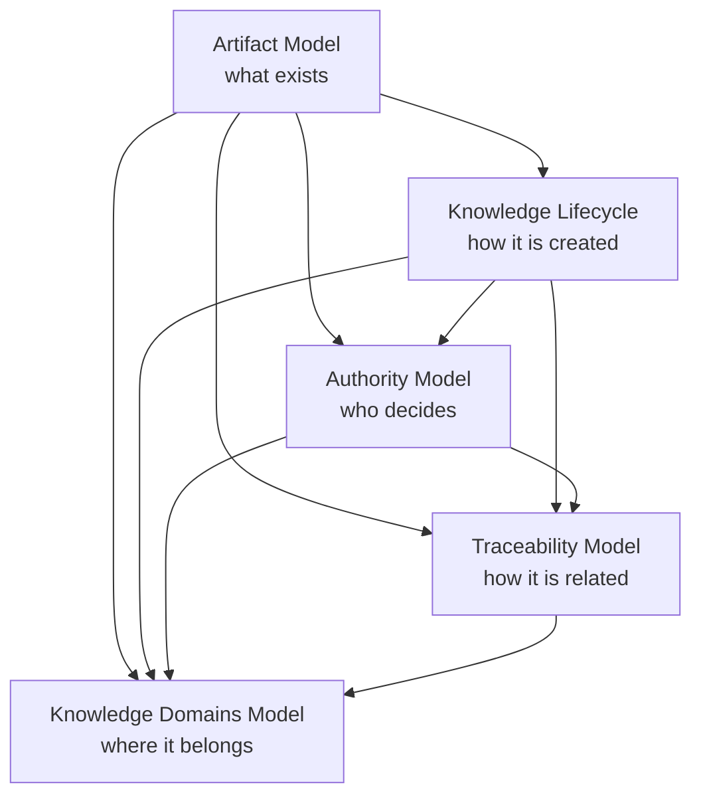
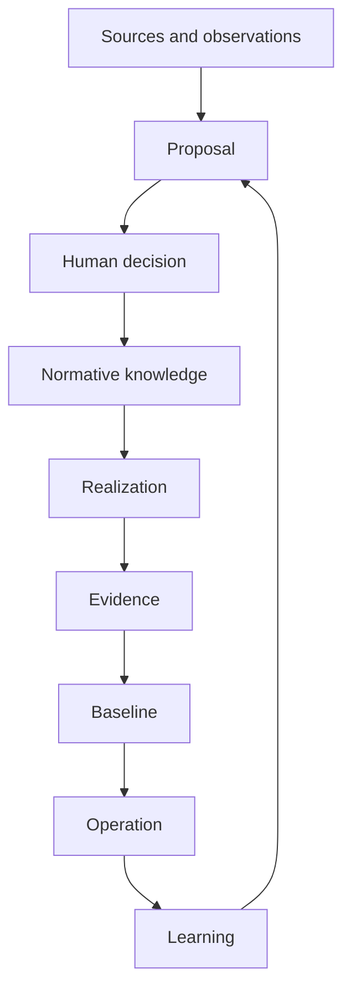

# KDD Knowledge Architecture

**Status:** Accepted  
**Version:** 0.1  
**Project:** Knowledge-Driven Development  
**Accepted:** 2026-07-18

## 1. Purpose

This document is the normative overview and entry point for the Knowledge
Architecture of Knowledge-Driven Development (KDD).

Knowledge Architecture defines:

- which units of knowledge exist;
- how knowledge is created and changes state;
- who may make decisions;
- how artifacts are related; and
- which semantic domain owns each meaning.

The five detailed models have distinct ownership:

| Model | Question |
| --- | --- |
| [Artifact Model](artifact-model.md) | What is a unit of knowledge? |
| [Knowledge Lifecycle](knowledge-lifecycle.md) | How is knowledge created and changed? |
| [Knowledge Authority Model](authority-model.md) | Who may decide? |
| [Knowledge Traceability Model](traceability-model.md) | What does knowledge derive from and realize? |
| [Knowledge Domains Model](knowledge-domains.md) | Where does a meaning belong? |

This overview summarizes their collaboration. Each detailed model remains the
authoritative source for its own semantics.

## 2. Core KDD statement

> Knowledge is the primary project asset. Code, configuration, tests and
> delivery documentation are realizations of that knowledge and evidence about
> its implementation.

KDD does not treat documentation as an appendix to code. Normative knowledge
defines:

- why a product exists;
- what it must do;
- which domain rules apply;
- how responsibilities are structured;
- which contracts govern boundaries;
- what has been realized; and
- what has actually been verified.

Implementation may reveal missing or incorrect knowledge. It cannot silently
become the new source of business rules, requirements, contracts or durable
decisions.

## 3. Model dependencies



The dependency arrows express semantic dependency between the detailed models.
They are not implementation packages or mandatory repository dependencies.

## 4. Reading order

### 4.1 Artifact Model

Read [KDD Artifact Model](artifact-model.md) first.

It defines:

- artifact types;
- stable identifiers;
- three independent status dimensions;
- relationship vocabulary;
- minimum metadata;
- evidence artifacts;
- identifier and evolution rules; and
- minimal and extended profiles.

It owns the answer to:

> What constitutes a KDD knowledge artifact?

### 4.2 Knowledge Lifecycle

Read [KDD Knowledge Lifecycle](knowledge-lifecycle.md) second.

It defines:

- transition from trigger and observation to proposal;
- discovery and analysis;
- review and human acceptance;
- impact analysis;
- realization readiness;
- implementation and verification;
- Knowledge Baseline;
- operation and learning;
- allowed knowledge-status transitions; and
- Knowledge Gates.

It owns the answer to:

> How does knowledge change state?

### 4.3 Knowledge Authority Model

Read [KDD Knowledge Authority Model](authority-model.md) third.

It defines:

- knowledge ownership;
- proposal, review and decision authority;
- implementation and verification authority;
- risk and baseline authority;
- source authority;
- conflict resolution;
- delegation;
- automatic verification authority; and
- the autonomy boundary of AI.

It owns the answer to:

> Who has authority to perform or accept a knowledge action?

### 4.4 Knowledge Traceability Model

Read [KDD Knowledge Traceability Model](traceability-model.md) fourth.

It defines:

- relationship direction;
- typed relationship semantics;
- claim-level evidence;
- completeness rules;
- change impact analysis;
- evidence invalidation;
- Knowledge Baseline traceability;
- cross-repository references;
- implementation references; and
- automation and graph health.

It owns the answer to:

> What does an artifact derive from, realize, satisfy or verify?

### 4.5 Knowledge Domains Model

Read [KDD Knowledge Domains Model](knowledge-domains.md) fifth.

It defines:

- nine semantic knowledge domains;
- their questions, boundaries and owners;
- cross-cutting concerns;
- primary artifact classification;
- inter-domain dependency rules;
- incomplete knowledge and incremental delivery;
- anti-patterns; and
- minimal and extended organization profiles.

It owns the answer to:

> Which semantic domain owns this meaning?

## 5. Integrated artifact model

A consequential KDD artifact combines the semantics of all five models.

Example:

```yaml
identity:
  id: CTR-006
  type: contract
  title: Submission contract

classification:
  primary_domain: contracts-and-interfaces
  scope: submission

authority:
  owner: contract-owner
  decision_authority: architecture-authority

status:
  knowledge: accepted
  implementation: partial
  verification: partially-verified

traceability:
  depends_on:
    - REQ-004
    - ADR-008
  satisfies:
    - REQ-004

provenance:
  sources:
    - official-specification
  proposed_by: human-ai-collaboration
  accepted_by: human
```

Each section has one semantic owner:

| Metadata concern | Owning model |
| --- | --- |
| `id`, `type`, status dimensions | Artifact Model |
| allowed status transitions | Knowledge Lifecycle |
| `owner`, reviewers and decision authority | Knowledge Authority Model |
| `depends_on`, `satisfies` and evidence links | Knowledge Traceability Model |
| `primary_domain` | Knowledge Domains Model |

The concrete serialization is replaceable. The semantic distinctions are
normative.

## 6. Integrated knowledge flow



Throughout the flow:

- the Artifact Model defines artifact identity and status dimensions;
- the Knowledge Lifecycle defines allowed transitions;
- the Authority Model controls decisions and delegation;
- the Traceability Model preserves derivation and evidence;
- the Knowledge Domains Model preserves semantic ownership.

The cycle may return to an earlier point whenever evidence, implementation or
operation reveals missing, conflicting or obsolete knowledge.

## 7. Knowledge Architecture invariants

### KA-1 — Single Knowledge Ownership

Every definition, rule, decision and status claim has exactly one authoritative
owner. Summaries, indexes, translations and implementation do not create a
second owner.

### KA-2 — Artifact Is Not a File

A file is a storage container. An artifact is a unit of knowledge with identity,
meaning, ownership, status and relationships.

One file may contain several coherent artifacts. One artifact may have derived
representations. The authoritative identity remains stable independently of
file movement.

### KA-3 — Independent Status Dimensions

Knowledge approval, implementation maturity and verification status are
independent.

An accepted artifact may be unimplemented. An implemented artifact may be
unverified. Verified evidence may apply only to a partial or experimental
boundary.

### KA-4 — Human Acceptance

AI may gather sources, analyze, propose, implement, test and review. A material
artifact becomes normative only through authorized human acceptance.

Automation may apply a verification result only under a previously
human-accepted policy and scope.

### KA-5 — Upstream Before Downstream

Downstream knowledge derives from upstream knowledge and cannot silently change
it.

A downstream discovery that challenges upstream meaning creates a proposal for
the upstream owner and re-enters the Knowledge Lifecycle.

### KA-6 — Contracts Before Code

Material observable behaviour at a boundary is defined by an accepted contract
before the implementation can be treated as conforming or authoritative.

An experiment may precede a final contract when it is explicitly bounded as
research and cannot create a product compatibility claim.

### KA-7 — Code Is Realization

Code, configuration and migrations realize accepted knowledge. They do not own
product vision, domain rules, requirements, contract semantics or durable
architecture decisions.

### KA-8 — Evidence Is Bounded

Evidence supports only the exact claim, subject version, environment, boundary
and limitations that it declares.

Evidence from a unit, substitute, DEMO or local environment cannot be silently
generalized to integration, restart durability, regulatory compliance or
production readiness.

### KA-9 — Learning Re-enters the Lifecycle

Tests, incidents, telemetry and user feedback create observations and learning.
They do not automatically rewrite normative knowledge.

### KA-10 — History Is Preserved

Knowledge evolution preserves previous decisions, revisions, supersession,
evidence validity and the reasons for change.

Cleanup removes duplication without erasing decision history.

## 8. Example traceability chain

```text
VIS-001
Purpose: vendor-neutral KSeF communication library

→ CAP-002
Capability: support independent ERP connectors

→ REQ-014
Requirement: Core has no dependency on a specific ERP

→ ADR-008
Decision: Core remains ERP-independent

→ CTR-021
Contract: connector implements a Core-owned Port Contract

→ INC-031
Increment: extract ksef-optima-connector

→ EVD-044
Evidence: architecture test prohibits ERP dependencies

→ AUD-003
Audit: architecture review after migration
```

Each element:

- has one artifact type;
- belongs to one primary semantic domain;
- has the applicable owner and authority;
- derives from upstream knowledge;
- may have independent knowledge, implementation and verification status; and
- is verified only within a declared scope.

The identifiers in this example illustrate the model. They do not assign new
identifiers to existing KSeF_2 documents.

## 9. Normative sources

The authoritative detailed sources are:

1. [KDD Artifact Model](artifact-model.md);
2. [KDD Knowledge Lifecycle](knowledge-lifecycle.md);
3. [KDD Knowledge Authority Model](authority-model.md);
4. [KDD Knowledge Traceability Model](traceability-model.md); and
5. [KDD Knowledge Domains Model](knowledge-domains.md).

This README is an accepted overview and index. If a summary here appears to
differ from a detailed model, the model that owns the subject takes precedence.

A semantic change must therefore be made first in the owning model and then
propagated to this overview. Editing only this overview cannot change detailed
KDD semantics.

## 10. Minimal and extended profiles

### 10.1 Minimal profile

A small project may group knowledge into a limited number of files. It must
still retain, for consequential artifacts:

- stable identity;
- one primary semantic domain;
- accountable owner;
- applicable decision authority;
- status dimensions;
- provenance;
- upstream derivation;
- implementation reference where claimed; and
- bounded evidence where verified.

### 10.2 Extended profile

A larger, regulated, long-lived or multi-repository project may add:

- separate artifact registries;
- machine-readable metadata schemas;
- generated indexes;
- traceability graph;
- automated conflict and orphan checks;
- transitive impact analysis;
- evidence invalidation;
- baseline manifest;
- formal authority matrices; and
- conformance reports.

A profile changes detail and automation. It does not change the meaning or
authority boundaries of the five models.

## 11. Conformance

A project's Knowledge Architecture conforms to KDD when:

- it preserves the distinct responsibilities of the five models;
- every normative meaning has one owner;
- artifact identity is not reduced to a file path;
- knowledge, implementation and verification status remain independent;
- normative acceptance belongs to authorized humans;
- implementation derives from accepted upstream knowledge;
- typed relationships are reproducible;
- evidence is bounded to exact claims and subject versions;
- conflicts remain visible until resolved;
- semantic changes follow the Knowledge Lifecycle and impact analysis;
- operational learning re-enters the lifecycle as captured or proposed
  knowledge; and
- a minimal project may simplify storage without collapsing semantic
  responsibilities.

Conformance does not require a specific schema language, folder structure,
graph database, programming language, architecture style, repository platform
or AI provider.

## 12. Scope not yet defined

This Knowledge Architecture does not yet define:

- the complete end-to-end KDD project method;
- detailed discovery practices;
- domain-modeling techniques;
- artifact templates;
- metadata serialization schemas;
- automated validators;
- repository blueprint for an adopting project;
- maturity assessment;
- release governance for KDD itself; or
- adoption and migration guidance.

These concerns belong to subsequent layers of the methodology. They must use
the Knowledge Architecture rather than redefine it.

## 13. Knowledge Architecture 0.1 module

The accepted Knowledge Architecture 0.1 consists of:

```text
docs/10-knowledge-architecture/
├── README.md
├── artifact-model.md
├── knowledge-lifecycle.md
├── authority-model.md
├── traceability-model.md
└── knowledge-domains.md
```

Together these documents establish the first complete normative module of KDD.
