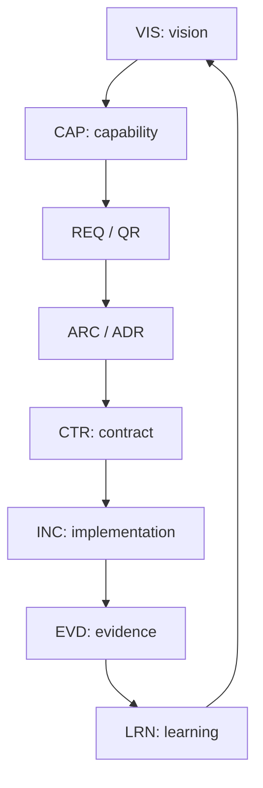

# KDD Artifact Model

**Status:** Accepted  
**Version:** 0.1  
**Project:** Knowledge-Driven Development  
**Accepted:** 2026-07-18  
**Accepted by:** Krzysztof Olejnik — KDD Methodology Owner  

## 1. Purpose

This document defines the artifact model of Knowledge-Driven Development
(KDD). It specifies the kinds of knowledge artifacts used by the methodology,
their authority, lifecycle states, relationships, minimum metadata and
verification rules.

The model is independent of programming language, framework, architecture
style, repository host and AI provider. A project may use a minimal or extended
profile, but it must preserve the semantic distinctions defined here.

## 2. Fundamental rules

1. Every normative item of knowledge has exactly one authoritative owner.
2. Downstream artifacts reference upstream knowledge instead of redefining it.
3. Accepted knowledge changes only through an explicit human decision.
4. A changed durable decision supersedes the previous decision; identifiers are
   immutable and never reused.
5. AI output remains a proposal until accepted by an authorized human.
6. Code is a realization of knowledge and cannot silently redefine a
   requirement, contract or decision.
7. Evidence always identifies the exact claim, version, boundary, environment
   and limitations that it verifies.
8. Accepted architecture does not by itself prove implementation.
9. Existing implementation does not by itself prove conformance with accepted
   architecture.
10. Indexes, README files, translations and generated summaries do not create
    competing sources of truth.

These rules establish the **Single Knowledge Ownership Principle**:

> Every definition, rule, decision and status claim has exactly one
> authoritative artifact. Other documents reference that artifact rather than
> copying its normative meaning.

## 3. Artifact and file are different concepts

A knowledge artifact is an identifiable unit of project knowledge. A file is
only a storage container.

One coherent document may contain several artifacts. For example, one use-case
catalogue may contain `UC-001` through `UC-008`. Each artifact that affects
project decisions must nevertheless remain addressable by a stable identifier
or unambiguous anchor.

KDD does not require one file per artifact and does not assign identifiers to
every paragraph, note, AI conversation or implementation task.

## 4. Artifact catalogue

| Prefix | Artifact | Responsibility |
| --- | --- | --- |
| `PRN` | Principle | A governing and durable project rule. |
| `VIS` | Vision | Product problem, purpose, audience, outcomes and boundaries. |
| `TERM` | Term | One authoritative definition in the project language. |
| `BR` | Business Rule | A durable business or domain rule. |
| `ASM` | Assumption | A claim that requires confirmation. |
| `RISK` | Risk | Uncertainty, possible impact and treatment. |
| `CAP` | Capability | A product ability that provides value. |
| `UC` | Use Case | Behaviour that achieves an actor's goal. |
| `SCN` | Scenario | A concrete flow and expected outcome. |
| `REQ` | Requirement | A functional requirement. |
| `QR` | Quality Requirement | A quality or non-functional requirement. |
| `CON` | Constraint | A legal, organizational, business or technical restriction. |
| `ARC` | Architecture Specification | System structure, boundaries, ownership and allowed dependencies. |
| `ADR` | Architecture Decision | An accepted durable architecture decision. |
| `CTR` | Contract | Observable behaviour at a component or system boundary. |
| `RFC` | Request for Comments | A proposed solution or technical contract requiring review. |
| `INC` | Increment | A bounded unit selected for realization. |
| `EVD` | Evidence | Evidence supporting one or more explicit claims. |
| `AUD` | Audit | A scoped review of consistency, quality or conformance. |
| `LRN` | Learning | Knowledge obtained from verification or operation. |

A project profile may introduce additional artifact types when it defines their
authority and relationships without changing the meanings above.

## 5. Primary knowledge flow



Additional relationships apply throughout this flow:

- `TERM` and `BR` supply the language and rules used by capabilities,
  requirements and architecture;
- `ASM` and `RISK` may relate to any artifact;
- `SCN` makes a capability, use case or requirement concrete;
- an `RFC` may lead to an `ADR`, `CTR` and `INC`;
- an `AUD` checks a selected part or the whole knowledge chain.

## 6. Independent status dimensions

A single status field is insufficient. KDD separates knowledge approval,
implementation maturity and verification.

### 6.1 Knowledge status

```text
captured
→ proposed
→ reviewed
→ accepted
→ superseded
→ retired
```

`rejected` is an additional terminal state for a proposal that was considered
and not accepted.

- `captured`: an observation, need or idea has been recorded;
- `proposed`: a coherent candidate artifact exists;
- `reviewed`: review is complete, but acceptance has not yet been granted;
- `accepted`: an authorized human has made the artifact normative;
- `superseded`: another accepted artifact replaced it;
- `retired`: it is no longer applicable and has no direct replacement;
- `rejected`: it was considered and deliberately not adopted.

### 6.2 Implementation status

```text
not-applicable
not-started
planned
in-progress
experimental
partial
implemented
deprecated
removed
```

Implementation status is always interpreted within the artifact's declared
scope. `experimental` or `partial` must identify the missing boundary or
guarantee. `implemented` requires realization at the intended boundary, not
merely the existence of related code.

### 6.3 Verification status

```text
not-required
unverified
partially-verified
verified
invalidated
```

Verification status never stands alone. It must reference evidence and its
scope. Evidence from a unit test, controlled substitute or DEMO environment
must not be generalized to production behaviour.

Example:

```yaml
knowledge_status: accepted
implementation_status: experimental
verification_status: partially-verified

verification_scope:
  environment: demo
  boundary: in-memory-storage
  limitations:
    - no process-restart durability
    - no production database
```

## 7. Minimum metadata

Every normative artifact must provide at least:

```yaml
id: ADR-001
type: architecture-decision
title: Decision title

knowledge_status: accepted
implementation_status: planned
verification_status: unverified

scope: Scope in which the artifact applies
owner: architecture-owner
decision_authority: product-owner

depends_on:
  - REQ-004
  - QR-002

supersedes: null

created_at: YYYY-MM-DD
accepted_at: YYYY-MM-DD
last_reviewed_at: YYYY-MM-DD

provenance:
  proposed_by: human-ai-collaboration
  accepted_by: human
```

Projects may use Markdown front matter, tables, structured files or another
machine-readable representation. The semantics are normative; the serialization
format is replaceable.

The inverse relation `downstream` should not be maintained manually. It should
be derived from authoritative upstream links such as `depends_on`, because
duplicated bidirectional links easily become inconsistent.

## 8. Relationship vocabulary

| Relationship | Meaning |
| --- | --- |
| `depends_on` | The artifact requires upstream knowledge. |
| `defines` | The artifact owns a definition. |
| `satisfies` | An element satisfies a requirement or constraint. |
| `realizes` | An implementation or increment realizes a contract or architecture element. |
| `constrained_by` | The artifact is limited by another artifact or external obligation. |
| `verified_by` | The claim is supported by referenced evidence. |
| `derived_from` | The artifact is a non-authoritative derivative. |
| `supersedes` | The artifact replaces an earlier artifact. |
| `conflicts_with` | An unresolved contradiction has been detected. |

An accepted release of project knowledge should not contain an unresolved
`conflicts_with` relation without an explicit exception owner, scope and
resolution plan.

## 9. Authority hierarchy

| Level | Knowledge |
| --- | --- |
| 0 | Binding law, standards and external obligations. |
| 1 | Project principles, vision, product boundaries and governance. |
| 2 | Domain model, terminology and business rules. |
| 3 | Capabilities, use cases, requirements and acceptance criteria. |
| 4 | Architecture specifications and accepted decisions. |
| 5 | Contracts. |
| 6 | Delivery increments and implementation. |
| 7 | Evidence, reports, observations and operational learning. |

A downstream artifact cannot silently override upstream knowledge.

If implementation reveals that a requirement must change, the requirement is
changed first through its own authority and lifecycle. The affected
architecture, contracts, implementation and verification are then reviewed and
updated. Existing code does not automatically become the specification.

An ADR may clarify or choose within accepted upstream constraints. It cannot
override a principle, business rule or requirement unless the owning upstream
artifact is explicitly changed or superseded.

## 10. Common document roles

| Document | Authority |
| --- | --- |
| README | Informative entry point; not a substitute for normative artifacts. |
| Manifest | Normative values and principles. |
| Vision | Normative product purpose and boundaries. |
| Glossary | Index of terms and their authoritative definitions. |
| ADR | Normative durable decision. |
| RFC | Proposal or accepted technical contract; does not by itself prove implementation. |
| Roadmap | Current order and maturity assessment; not a source of requirements. |
| Release notes | Historical description of a particular release. |
| Audit | Scoped conformance assessment at a declared point in time. |
| Test report | Evidence with an explicit boundary and limitations. |
| Translation | Derived artifact that cannot introduce normative meaning. |
| Code | Realization of accepted knowledge, not the owner of product decisions. |

A status must have one authoritative location. README files and registries
should link to it rather than maintain independent copies. When tooling is
available, indexes should be generated from artifact metadata.

## 11. Evidence model

Every `EVD` must state:

1. the claims it verifies;
2. the subject and exact version;
3. the environment in which it was obtained;
4. the boundary that was actually exercised;
5. the guarantees it does not establish;
6. the date and responsible actor;
7. whether and how the evidence can be reproduced.

Example:

```yaml
id: EVD-014
type: test-result

verified_claims:
  - CTR-006
  - REQ-021

subject_version: 0.10.1
environment: controlled-demo
verification_status: verified

limitations:
  - in-memory storage only
  - no restart durability
  - no production deployment
```

Evidence can invalidate an assumption or reveal a conflict. It does not
silently edit the affected knowledge. It creates a proposed change or
`LRN` artifact for human review.

## 12. KDD profiles

### 12.1 Minimal profile

A small project must maintain at least:

1. product vision and boundaries;
2. essential terms and business rules;
3. capabilities or use cases;
4. requirements and acceptance criteria;
5. a basic architecture description;
6. ADRs for consequential decisions;
7. contracts for material boundaries; and
8. evidence supporting completion claims.

The artifacts may be grouped into a small number of files.

### 12.2 Extended profile

A larger, regulated, long-lived or multi-team project should additionally
maintain:

- separate assumption and risk registers;
- formal RFC and ADR registries;
- quality requirements and constraints;
- architecture views and component ownership;
- contract compatibility rules;
- implementation increments;
- an evidence registry;
- architecture and conformance audits;
- operational learning and supersession history.

The selected profile should be recorded in project governance and may evolve
as the project grows.

## 13. Identifier rules

Stable identifiers are required for items with meaningful project impact,
including:

- principles;
- business and domain rules;
- capabilities and use cases;
- requirements and quality requirements;
- assumptions and risks;
- durable decisions;
- contracts;
- evidence;
- learning that changes the project.

Identifiers are not required for:

- every paragraph;
- transient working notes;
- unreviewed AI conversation;
- routine implementation activity;
- mechanical or cosmetic changes.

Identifiers are immutable and never reused. A renamed artifact retains its
identifier. A changed decision is represented by a new artifact that
`supersedes` the previous one.

## 14. Human and AI authority

AI may gather sources, identify gaps, detect contradictions, propose models,
draft artifacts, implement accepted contracts, generate verification and
perform an additional review.

AI must not:

- accept its own proposal;
- change product goals or business rules without human authorization;
- silently broaden evidence;
- treat generated code as an accepted requirement;
- waive a quality gate;
- accept project risk on behalf of a human.

A material AI-created or AI-modified artifact starts no higher than
`proposed`. Human acceptance records the decision authority independently
from authorship.

## 15. Evolution rules

1. A clarification may update an accepted artifact only when it does not change
   its observable meaning.
2. A semantic change creates a new revision or artifact according to that
   artifact type's governance.
3. A changed durable decision requires a new decision that supersedes the old
   one.
4. A change to upstream knowledge triggers an impact review of dependent
   artifacts.
5. Previously valid evidence is marked `invalidated` when its subject,
   boundary or prerequisite changes materially.
6. Historical artifacts remain available to explain why the current state
   exists.
7. Knowledge cleanup removes duplication but does not erase decision history.

## 16. Origin and applicability

This model was extracted from practical experience developing KSeF_2 and then
generalized for projects independent of domain, language and framework.

KSeF_2 demonstrates the value of ordered normative documentation, explicit
domain boundaries, use cases, contract-first design, ADR and RFC registries,
bounded implementation claims, automated verification and architecture audits.
KDD adopts those general lessons without requiring KSeF_2-specific choices
such as Hexagonal Architecture, Python, pytest, a particular coverage target,
English as the normative language, or a particular AI product.
