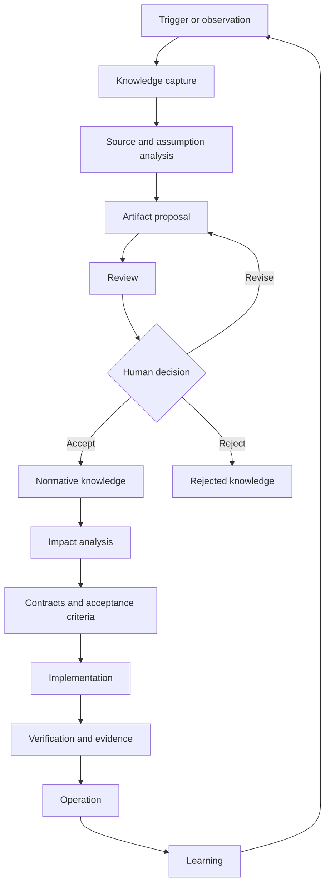
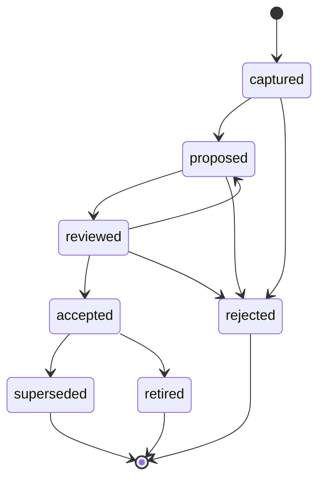

# KDD Knowledge Lifecycle

**Status:** Accepted  
**Version:** 0.1  
**Project:** Knowledge-Driven Development  
**Accepted:** 2026-07-18  
**Depends on:** [KDD Artifact Model](artifact-model.md)

## 1. Purpose

This document defines how knowledge is captured, analyzed, proposed, reviewed,
accepted, realized, verified and evolved in Knowledge-Driven Development (KDD).

The lifecycle is independent of programming language, framework, architecture
style, repository host and AI provider. It governs the transition from
observation to normative knowledge and from normative knowledge to
implementation and evidence.

KDD is iterative, not a rigid waterfall. Multiple capabilities and increments
may evolve concurrently. Downstream knowledge must nevertheless be derived
from sufficiently mature upstream knowledge, and an upstream change requires an
impact review of its dependants.

## 2. Complete lifecycle



The cycle may return to any earlier stage when a contradiction, missing
requirement, invalid assumption, unsafe boundary or insufficient contract is
discovered.

## 3. Lifecycle stages

### 3.1 Trigger

A knowledge cycle starts with a meaningful stimulus, including:

- a business need;
- a question or problem;
- a change in law, regulation, standard or an external system;
- a test result or failed quality gate;
- an incident;
- a proposal from a human or AI;
- user feedback;
- an operational observation; or
- evidence that contradicts an existing assumption.

A trigger is not assumed to be true, relevant or correctly interpreted merely
because it was recorded.

### 3.2 Capture

The trigger is captured as one or more of:

- observation;
- source;
- assumption;
- risk;
- unresolved question;
- candidate learning; or
- potential change.

The initial knowledge status is `captured`.

A chat, working note, transcript or exploratory result may remain transient.
KDD does not require every piece of working material to become a durable
artifact. Material becomes durable when it can affect a project decision,
requirement, contract, risk, evidence claim or future interpretation.

### 3.3 Discovery and analysis

Humans and AI collaborate to:

1. identify and evaluate relevant sources;
2. separate facts from interpretations;
3. make assumptions explicit;
4. detect contradictions and missing information;
5. determine scope and exclusions;
6. identify risks and unknowns;
7. inspect existing project knowledge;
8. find the authoritative owner of related knowledge; and
9. assign an owner and decision authority for the candidate artifact.

Material claims should be classified as one of:

- sourced fact;
- direct observation;
- inference;
- hypothesis;
- assumption; or
- recommendation.

An unstable or time-sensitive external fact must retain its source and
observation date. Conflicting sources must remain visible until resolved; AI
must not silently select a convenient source and present the result as settled
knowledge.

### 3.4 Proposal

A coherent artifact is created with knowledge status `proposed`.

A material proposal should state:

- purpose;
- scope;
- sources and provenance;
- dependencies;
- assumptions;
- alternatives where meaningful;
- consequences;
- risks;
- exclusions and non-goals;
- compatibility impact; and
- proposed acceptance or verification criteria.

AI may create or improve the proposal but cannot accept it.

### 3.5 Review

Review evaluates:

- alignment with project principles and vision;
- domain correctness;
- completeness and internal consistency;
- conflicts with accepted knowledge;
- impact on dependent artifacts;
- security and privacy;
- compatibility;
- feasibility and cost;
- risk;
- testability and verifiability; and
- whether the proposed authority and scope are correct.

Review may result in:

- knowledge status `reviewed`;
- return to `proposed` for revision;
- a recommendation to reject;
- a new assumption or risk;
- a discovered conflict; or
- a blocker requiring human authority.

An AI review is valuable but is not human acceptance. For consequential
changes, a review independent from the original drafting context is
recommended where proportionate.

### 3.6 Human decision

An authorized human may:

- accept the proposal;
- reject it;
- request revision;
- limit its scope;
- defer the decision; or
- explicitly accept a known risk.

Only a human decision authority may transition an artifact to `accepted`.

Acceptance records:

- accepting person or role;
- date;
- accepted scope;
- known limitations;
- applicable conditions;
- explicitly accepted risks where relevant; and
- the accepted artifact revision.

A deferred proposal remains non-normative. Deferral does not create an
additional implementation authorization.

### 3.7 Impact analysis

Before realization, the project identifies the accepted artifact's effect on:

- vision and product boundaries;
- terminology and business rules;
- capabilities, use cases and scenarios;
- functional and quality requirements;
- architecture and durable decisions;
- contracts;
- existing code and data;
- tests and evidence;
- compatibility and migration;
- security and operations; and
- previously accepted risks.

An upstream change triggers review of artifacts that depend on it. Impact
analysis must distinguish artifacts that require a semantic change from those
that only require a refreshed reference, test or status.

### 3.8 Realization readiness

Implementation may begin when the intended increment has, in proportion to its
risk:

- an accepted purpose and scope;
- accepted upstream requirements;
- acceptance criteria;
- necessary architecture decisions;
- contracts for material boundaries;
- known assumptions and risks;
- a declared verification approach; and
- no unresolved conflict that invalidates the intended work.

Not every implementation detail requires advance human approval. An AI agent or
human implementer may make local, reversible technical decisions that remain
inside accepted requirements, architecture, contracts, security boundaries and
risk limits.

A decision must return to human authority when it changes functionality,
business rules, architecture, security, compatibility, evidence scope or
accepted risk.

### 3.9 Implementation

Implementation realizes accepted knowledge through code, configuration,
migration, documentation or another deliverable appropriate to the project.

During implementation, the team or AI may discover:

- a missing requirement;
- an invalid assumption;
- an infeasible contract;
- an architecture conflict;
- an unhandled risk; or
- evidence that an accepted boundary is insufficient.

The implementer must not silently redefine the solution. The discovery creates
a new captured item, assumption, risk, RFC or learning artifact, and the
lifecycle returns to the appropriate earlier stage.

Implementation status is maintained independently from knowledge status. An
accepted contract may be `not-started`, `experimental`, `partial` or
`implemented`.

### 3.10 Verification

Verification compares the realization with accepted knowledge.

Evidence identifies:

- the claims being verified;
- the subject and exact version;
- the environment;
- the exercised boundary;
- the method and result;
- limitations and excluded guarantees;
- reproducibility; and
- the responsible actor and date.

The implementation status `implemented` requires proportionate evidence at
the intended boundary. A passing unit test cannot establish integration,
restart durability, regulatory compliance or production readiness unless those
claims were actually exercised.

A failed verification does not automatically change accepted knowledge. It may
change implementation or verification status and creates a new trigger for
analysis.

### 3.11 Knowledge baseline

After the applicable gates pass, a project may establish a knowledge baseline
that binds:

- accepted knowledge;
- implementation version;
- applicable contracts;
- evidence;
- known limitations; and
- accepted residual risks.

A release or completion claim should identify the knowledge baseline and
evidence from which it is derived. The baseline is a reproducible point of
reference, not a claim that all future work is complete.

### 3.12 Operation and learning

Operation supplies:

- runtime results;
- incidents;
- measurements;
- user feedback;
- newly observed constraints;
- changes in external systems;
- disproven assumptions; and
- new opportunities.

A `LRN` artifact records the learning and its evidence. Learning does not
silently change normative knowledge. It starts a new cycle of proposal, review
and human decision.

## 4. Knowledge status transitions



The allowed transitions are:

| From | To | Authority |
| --- | --- | --- |
| `captured` | `proposed` | Artifact owner or authorized contributor. |
| `captured` | `rejected` | Human owner with recorded rationale. |
| `proposed` | `reviewed` | Reviewer; review does not accept the artifact. |
| `proposed` | `rejected` | Human decision authority. |
| `reviewed` | `proposed` | Reviewer or decision authority requesting revision. |
| `reviewed` | `accepted` | Human decision authority only. |
| `reviewed` | `rejected` | Human decision authority only. |
| `accepted` | `superseded` | Human authority accepting the replacement. |
| `accepted` | `retired` | Human authority confirming it no longer applies. |

AI may recommend every transition but cannot perform the transition to
`accepted`, accept risk or act as the final decision authority.

## 5. Knowledge gates

| Gate | Exit condition |
| --- | --- |
| `KG-1 Proposal Ready` | Purpose, scope, sources, assumptions, owner and provenance are identified. |
| `KG-2 Decision Ready` | Review, alternatives, impact, compatibility and risk have been evaluated proportionately. |
| `KG-3 Accepted Knowledge` | An authorized human accepted the artifact, scope and known limitations. |
| `KG-4 Realization Ready` | Requirements, acceptance criteria, necessary decisions, material contracts and verification approach exist. |
| `KG-5 Implementation Complete` | The declared increment has been realized without unresolved scope-changing conflicts. |
| `KG-6 Claim Verified` | Proportionate evidence supports the exact claim and records its limitations. |
| `KG-7 Baseline Ready` | Knowledge, implementation, evidence, limitations and residual risks form a consistent reference point. |
| `KG-8 Learning Reviewed` | Operational learning has been assessed and routed into the lifecycle. |

A gate is a semantic condition, not a mandatory meeting or form. In a small
project, one authorized person may record a concise decision. In a large,
regulated or high-risk project, the same gate may require formal review and
multiple authorities.

A blocked gate stops only the affected scope. It does not automatically block
unrelated capabilities or reversible exploratory work that cannot create an
unauthorized product claim.

## 6. Changing accepted knowledge

### 6.1 Clarification

When observable meaning does not change:

- retain the identifier;
- update the revision and review date;
- record that the change is a clarification;
- preserve links and decision history; and
- recheck dependent summaries where necessary.

A clarification must not add a new obligation, weaken a guarantee or change
accepted behaviour.

### 6.2 Compatible change

When an artifact retains its identity and existing valid uses remain correct:

- retain the stable identifier;
- increment its version or revision;
- perform impact analysis;
- update affected dependent artifacts; and
- refresh or extend evidence where the changed scope requires it.

Compatibility must be demonstrated, not assumed from an additive file diff.

### 6.3 Semantic or incompatible change

When meaning, responsibility, observable behaviour, guarantee or compatibility
changes materially:

- create a new artifact or separately versioned contract;
- reference the previous artifact with `supersedes`;
- define migration and coexistence where required;
- mark obsolete evidence `invalidated`;
- update dependent knowledge through its own lifecycle; and
- retain historical artifacts.

A change to a durable architecture decision always requires a new ADR that
supersedes the earlier decision. An accepted ADR may be edited in place only for
a non-semantic clarification.

## 7. Human and AI collaboration

| Stage | AI contribution | Human responsibility |
| --- | --- | --- |
| Capture | Structures observations and working material. | Supplies or confirms the problem and context. |
| Discovery | Finds sources, separates claims and identifies gaps. | Evaluates business relevance and source authority. |
| Proposal | Drafts artifacts, alternatives, consequences and exclusions. | Sets direction, scope and priorities. |
| Review | Detects contradictions, risks and missing evidence. | Judges trade-offs and accountable impact. |
| Decision | Recommends and explains alternatives. | Accepts, rejects, limits scope and accepts risk. |
| Implementation | Realizes accepted contracts and runs checks. | Authorizes scope-changing or high-impact decisions. |
| Verification | Produces and analyzes evidence. | Accepts the claim scope and residual risk. |
| Learning | Identifies patterns and candidate changes. | Decides whether the product or methodology changes. |

AI must stop and obtain human direction when a decision would change:

- product purpose or boundary;
- functionality;
- a business or domain rule;
- architecture;
- security or privacy;
- compatibility or migration;
- the declared scope of evidence; or
- accepted risk.

AI does not need to interrupt for a routine, reversible implementation detail
whose answer is already constrained by accepted knowledge.

## 8. Iteration and concurrent work

KDD is not a requirement to finish every product document before any
implementation starts. It requires that each implementation claim has an
adequate upstream chain:

```text
requirement
→ architecture
→ contract
→ implementation
→ evidence
```

Several capabilities or increments may follow that chain concurrently.
Discovery in one increment may update shared upstream knowledge and trigger
impact review in the others.

Returning to an earlier stage is a normal knowledge-correction mechanism, not a
process failure. The project must preserve the reason for the change and avoid
silently rewriting history.

## 9. Example derived from KSeF_2

The durable UC-005 work in KSeF_2 illustrates the lifecycle:

```text
Need for restart-safe UC-005 execution
→ analysis of process-loss and ambiguous effects
→ RFC-0008 proposal
→ review of Coordinator and Workflow ownership
→ ADR-022 and ADR-023 human decisions
→ accepted durable execution contract
→ in-memory foundation implementation
→ automated tests and bounded evidence
→ limitation: no process-restart durability
→ production Storage remains planned
```

This example demonstrates that:

- knowledge may be accepted;
- part of a contract may be implemented;
- tests may verify that bounded implementation;
- verification may remain partial for the target capability; and
- production readiness may still be planned.

KDD generalizes this pattern: the status of knowledge, implementation and
verification must remain independent and scoped.

## 10. Conformance

A project conforms to this lifecycle when:

- material knowledge is captured with provenance;
- facts, inferences and assumptions are distinguished;
- proposals remain non-normative until human acceptance;
- accepted artifacts have an owner, authority and scope;
- downstream realization is derived from accepted upstream knowledge;
- scope-changing implementation discoveries return to the knowledge process;
- completion claims reference proportionate evidence;
- evidence states its environment, boundary and limitations;
- semantic changes preserve history and trigger impact analysis; and
- operational learning re-enters the lifecycle through proposal and review.

Conformance does not require a specific workflow tool, document format,
approval meeting, programming language or AI product.
