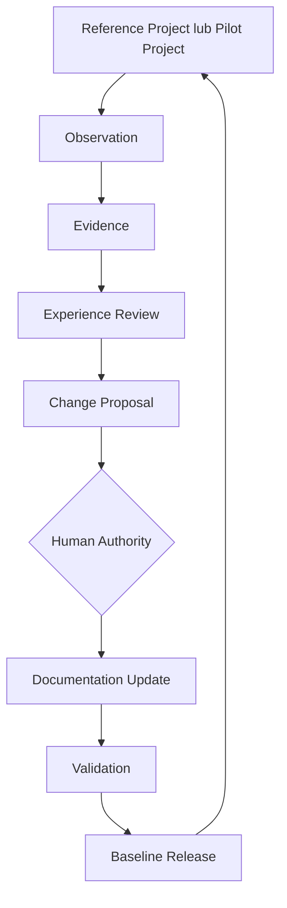

# KGAID Methodology Evolution Workflow

## 1. Cel i zakres

Ten dokument definiuje obowiązujący proces ewolucji metodyki KGAID, przez
który doświadczenia z rzeczywistego użycia mogą doprowadzić do kontrolowanej
zmiany samej metodyki. Określa drogę od sygnału z projektu przez obserwację,
dowody, przegląd, propozycję zmiany i decyzję człowieka do aktualizacji
dokumentacji, pozytywnej walidacji oraz wydania nowego baseline'u.

Proces nie opisuje tworzenia oprogramowania w projekcie stosującym KGAID.
Realizacja, testy i operacje projektu są tu istotne wyłącznie jako źródła
doświadczeń o metodyce.

Dokument:

- nie ustanawia nowego typu artefaktu, statusu ani roli;
- nie zmienia narzędzi ani workflow Approval;
- nie nadaje projektowi statusu `reference`;
- nie akceptuje Experience Record Model ani `KGAID-CP-004` jako normy;
- nie rozstrzyga żadnego istniejącego Change Proposal;
- nie zmienia opublikowanego ani przygotowanego baseline'u.

Dokument jest normatywny i wraz z regułami zawartymi w
[Foundations](../00-foundations/01-scope-and-boundaries.md),
[Knowledge Architecture](../10-knowledge-architecture/11-knowledge-architecture.md),
[Quality](../30-quality/31-verification-and-evidence-model.md),
[Adoption](../40-adoption/41-adoption-and-conformance-model.md) oraz
[Governance, Versioning, and Release Model](governance-and-release-model.md)
stanowi obowiązującą podstawę procesu ewolucji metodyki.
Modele w obszarze [Experience](../45-experience/README.md) i szczegółowy
[KGAID-CP-004](change-proposals/CP-004-experience-record-evidence-based-evolution.md)
pozostają szkicami. Gdy ich treść różni się od zaakceptowanych modeli KGAID,
pierwszeństwo ma zaakceptowany model.

## 2. Podstawa procesu

Proces wynika z czterech istniejących reguł:

1. KGAID rozwija się na podstawie dowodów z wielu projektów, celowego review i
   akceptacji człowieka. Projekt źródłowy jest źródłem empirycznym, nie
   normatywnym.
2. Obserwacja, rekomendacja, propozycja i decyzja są różnymi rodzajami wiedzy.
   Żaden z wcześniejszych etapów nie uzyskuje autorytetu etapu późniejszego
   przez samo powiązanie.
3. Twierdzenie o potrzebie lub skuteczności zmiany nie może być szersze niż
   wspierające je evidence.
4. Zmiana metodyki przechodzi istniejący lifecycle
   `Draft → Review → Accepted → Baseline`; publikacja baseline'u wymaga
   oddzielnej decyzji Maintainer.

Szczegółowość czynności i evidence powinna być proporcjonalna do wpływu,
niepewności, odwracalności i kosztu proponowanej zmiany. Proces jest
niezależny od narzędzia, formatu repozytorium i dostawcy AI.

Każda zmiana metodyki KGAID przechodzi przez Evolution Workflow. Zakres
poszczególnych etapów może być różny w zależności od rodzaju zmiany, ale nie
istnieje możliwość pominięcia Evolution Workflow.

## 3. Widok całego procesu



Strzałki oznaczają przepływ odpowiedzialności i traceability, a nie
automatyczne przejścia statusów. Nie każda obserwacja prowadzi do Change
Proposal, nie każda zaakceptowana propozycja trafia do najbliższego baseline'u,
a utworzenie baseline'u nie jest równoznaczne z jego publikacją.

Discovery jest iteracyjne. Wstępna obserwacja może wskazać, jakie evidence
należy zebrać, ale dostępne evidence może też ujawnić, zmienić albo podważyć
obserwację. Diagram przedstawia główny kierunek pętli, nie jednostronną
zależność przyczynową.

## 4. Źródła doświadczeń

Zmianę może zainicjować każdy istniejący zapis, który ujawnia wartość,
ograniczenie, konflikt, koszt lub lukę w stosowaniu KGAID. Sam sygnał uruchamia
Discovery; nie jest jeszcze uzasadnieniem zmiany normatywnej.

| Źródło | Możliwy sygnał dla metodyki | Granica interpretacji |
| --- | --- | --- |
| Reference Project | Powtarzalna praktyka, ograniczenie albo wynik stosowania określonego baseline'u KGAID. | Status `reference` wymaga zapisanej decyzji Human Authority; wpis w rejestrze ani nazwa katalogu go nie nadają. |
| Pilot Project | Pierwsze użycie, eksperyment, koszt adopcji lub problem zastosowania. | Pilot dostarcza evidence z jednego kontekstu i nie dowodzi uniwersalności. |
| Observation lub Learning | Wzorzec, odstępstwo, nowe ograniczenie, incydent, wynik operacyjny albo kandydat do uczenia. | Observation i `LRN` nie są regułami KGAID. |
| Evidence | Test, pomiar, przegląd, analiza, audit, eksperyment lub inny trwały zapis obserwacji. | Evidence jest autorytatywne tylko dla wskazanego claim, rewizji, granicy i warunków. |
| Research | Źródło zewnętrzne, wcześniejsza metoda, standard lub wynik badania wpływający na zakres albo założenia KGAID. | Należy ocenić pochodzenie, wersję, zastosowalność, aktualność i ograniczenia źródła. |
| Audit (`AUD`) | Niespójność, brak gotowości, ryzyko governance, wynik conformance lub potrzeba ponownej oceny. | Audit przedstawia wynik w swoim scope; sam nie zmienia dokumentu normatywnego. |
| Review | Konflikt, brak, nieaktualność, koszt, niewystarczające evidence albo potwierdzona wartość istniejącej reguły. | Review jest oceną i rekomendacją, nie akceptacją. |
| Human feedback | Pytanie, doświadczenie użytkownika metodyki, sprzeciw, rekomendacja lub informacja o koszcie. | Feedback jest triggerem wymagającym źródeł i analizy; autorytet autora nie zastępuje evidence ani decyzji. |

Źródła mogą pochodzić z projektu stosującego KGAID, repozytorium metodyki,
audytu zewnętrznego lub porównania kilku projektów. Referencja między
repozytoriami powinna identyfikować projekt, artefakt i niezmienną rewizję.
Kopiowanie całego repozytorium projektu do KGAID nie jest wymagane.

## 5. Discovery

### 5.1 Powstanie Observation

Discovery rozpoczyna się od triggera opisanego w Knowledge Lifecycle, na
przykład feedbacku, audytu, review, eksperymentu, incydentu, wyniku
weryfikacji, zmiany źródła zewnętrznego albo evidence przeczącego założeniu.
Observation może zgłosić dowolny uczestnik procesu, zarówno człowiek, jak i
AI. Human Authority pozostaje jedynym podmiotem uprawnionym do autoryzowania
zmian metodyki.
Sygnał staje się trwałą Observation, gdy może wpłynąć na interpretację
metodyki, przyszłą decyzję, ryzyko, claim o skuteczności albo sposób adopcji.
Materiał roboczy bez takiego wpływu może pozostać przejściowy.

Discovery rozdziela:

- fakt bezpośrednio sprawdzalny w źródle;
- Observation, czyli wzorzec wynikający z jednego lub wielu faktów;
- interpretację znaczenia dla projektu lub KGAID;
- hipotezę wymagającą sprawdzenia;
- rekomendację, która nadal nie jest decyzją.

W praktyce programu Experience Observation otrzymuje stabilny identyfikator w
Experience Record oraz opis faktu, wpływu, pewności, scope, evidence,
rekomendacji i potrzebnej authority. Jest to użycie istniejącego, nadal
roboczego Experience Record Model, a nie ustanowienie nowego wymagania.

Observation powinna jasno odróżniać:

- problem lokalny projektu od problemu metodyki;
- trudność zastosowania istniejącej reguły od luki w tej regule;
- potwierdzenie wartości od dowodu uniwersalnej skuteczności;
- brak evidence od evidence niekorzystnego;
- eksperyment od praktyki normatywnej.

### 5.2 Powstanie Evidence

Evidence powstaje przez zachowanie trwałego wyniku obserwacji, testu, analizy,
review, pomiaru, audytu lub odtwarzalnego eksperymentu. Dla doświadczenia
między repozytoriami minimalna ścieżka wskazuje:

1. źródłowy projekt lub trwały pakiet;
2. niezmienny commit, tag, hash treści albo równoważny identyfikator;
3. ścieżkę lub stabilny identyfikator przedmiotu;
4. sekcję, okres, metodę albo dokładne twierdzenie poddane ocenie;
5. wynik i jego relację do Observation;
6. granicę, warunki, ograniczenia oraz gwarancje, których wynik nie daje;
7. datę i aktora, a przy zmiennym źródle także datę dostępu;
8. poziom niezależności i możliwość odtworzenia proporcjonalne do claim.

Evidence wspierające i przeczące pozostają widoczne. Nowszy wynik nie usuwa
starszego; może go unieważnić lub zastąpić dla nowej rewizji, zachowując
historię. Raport, indeks lub Experience Record może streszczać evidence, lecz
nie staje się przez to jego źródłem.

### 5.3 Kiedy Observation może zostać zamknięta

Zaakceptowane dokumenty KGAID nie definiują osobnego, kanonicznego statusu
zamknięcia Observation. Roboczy Experience Record Model wymienia `closed` jako
zalecany stan walidacji, a propozycja lifecycle feedbacku używa `resolved`.
Żadna z tych propozycji nie zmienia obecnie normy.

Observation może zostać uznana za obsłużoną dopiero wtedy, gdy:

- jej evidence, scope, ograniczenia i alternatywne wyjaśnienia zostały
  przejrzane;
- ustalono, czy dotyczy projektu, metodyki, narzędzia czy relacji między nimi;
- właściwa reakcja została zapisana: brak zmiany, lokalna naprawa,
  clarification, eksperyment, odroczenie albo Change Proposal;
- wymagany wynik Human Authority i jego rationale są powiązane z dokładnym
  przedmiotem;
- jeśli reakcję wdrożono, wynik sprawdzono na wskazanej rewizji;
- historia, evidence i warunki ponownego otwarcia pozostały dostępne.

Commit, poprawiony dokument lub samo utworzenie CP nie zamyka Observation.
Observation odrzucona albo odroczona również pozostaje w historii. Authority
do zamknięcia obserwacji obejmującej jednocześnie projekt i KGAID pozostaje
otwartą kwestią.

## 6. Experience Review

Experience Review jest etapem analizy, nie nowym typem artefaktu. Może być
utrwalony przez istniejący audit, review, raport evidence albo Experience
Record, zależnie od scope i przyjętej praktyki.

### 6.1 Wejścia

Przegląd rozpoczyna się, gdy istnieje wystarczająco stabilny zakres do
odtworzenia. Wejście obejmuje:

- identyfikację projektu i dokładną rewizję materiału źródłowego;
- wersję, opublikowany baseline albo dokładną rewizję KGAID używaną przez
  projekt;
- pytania i scope przeglądu wraz z wyłączeniami;
- katalog Observation i dostępnego evidence;
- założenia, ryzyka, nieweryfikowane obszary i wcześniejsze decyzje;
- informację, czy wynik pochodzi z jednego czy z wielu projektów;
- wymagany poziom niezależności review.

### 6.2 Analiza

Reviewer:

1. sprawdza źródła, referencje i możliwość odtworzenia faktów;
2. porównuje praktykę z właściwą wersją i profilem KGAID, a nie z ruchomym
   stanem bieżącej gałęzi;
3. oddziela fakt, Observation, interpretację, hipotezę, rekomendację i decyzję;
4. ocenia impact, confidence, granice claim oraz evidence przeciwne;
5. sprawdza, czy przyczyną jest metodyka, sposób jej zastosowania, problem
   lokalny, narzędzie albo zmiana kontekstu;
6. szuka alternatywnych wyjaśnień i istniejących dokumentów, które już
   rozwiązują zgłoszony problem;
7. ocenia potrzebę potwierdzenia w drugim projekcie;
8. sprawdza zgodność kandydata ze wszystkimi Principles i granicą KGAID;
9. rozdziela reakcje lokalne od reakcji należących do governance metodyki;
10. wskazuje pytania wymagające Human Authority bez udzielania za nią
    odpowiedzi.

### 6.3 Wyniki

Experience Review zachowuje co najmniej:

- zakres, metodę, użyte rewizje i ograniczenia;
- katalog Observation po klasyfikacji;
- katalog evidence i jego relację do każdej Observation;
- mocne strony oraz granice skuteczności KGAID;
- problemy lokalne i problemy zastosowania;
- luki, niejednoznaczności i konflikty metodyki;
- hipotezy, eksperymenty i potrzebę porównania między projektami;
- kandydatów do clarification lub Change Proposal;
- propozycje odrzucenia lub odroczenia wraz z rationale;
- otwarte pytania i właściwą Human Authority.

Roboczy Experience Record Model stosuje klasyfikacje
`methodology-strength`, `methodology-application-problem`,
`local-project-problem`, `methodology-gap-or-ambiguity`, `experiment`,
`cross-project-hypothesis` i `rejected-for-now`. Są one istniejącą propozycją
porządkowania wyników, a nie nowym słownikiem ustanawianym przez ten dokument.

Experience Review nie zmienia baseline'u, statusu dokumentacji ani statusu
projektu. Jego wynik może zakończyć ścieżkę bez zmiany KGAID, skierować temat do
lokalnej naprawy lub eksperymentu albo uzasadnić przygotowanie Change Proposal.

## 7. Change Proposal

### 7.1 Kiedy utworzyć

Change Proposal należy przygotować, gdy Experience Review wskazuje zmianę
znaczenia metodyki, w szczególności:

- zmianę wymagania normatywnego, zdefiniowanego statusu, reguły conformance,
  zależności albo członkostwa baseline'u;
- nową regułę lub capability mającą obowiązywać poza jednym projektem;
- zmianę granicy, Principles, Knowledge Architecture albo modelu authority;
- usunięcie niejednoznaczności, jeżeli clarification zmieniałoby obowiązek lub
  jego interpretację;
- reakcję na konflikt zaakceptowanych dokumentów;
- empiryczny wzorzec, którego uogólnienie ma wpływ na kompatybilność, koszt
  adopcji lub zakres claim KGAID.

CP nie jest potrzebny wyłącznie dlatego, że projekt wybrał lokalny format,
narzędzie, nazwę, strukturę katalogów albo praktykę dozwoloną przez tailoring.
Problem lokalny pozostaje odpowiedzialnością projektu, nawet gdy ujawnił
dodatkowo niejednoznaczność metodyki.

### 7.2 Zawartość

Zgodnie z obecnym governance i zasadami contribution, CP opisuje:

- problem, oczekiwany wynik i rationale;
- powiązane Observation, Experience Record, evidence i ograniczenia;
- rozdzielenie faktów, interpretacji i rekomendacji;
- scope, wyłączenia oraz dokumenty, definicje i zależności objęte zmianą;
- warianty, w tym pozostawienie obecnego stanu, gdy jest zasadne;
- wpływ normatywny i zgodność ze wszystkimi Principles;
- compatibility assessment;
- proponowany wpływ na semantic version;
- konsekwencje migracji, współistnienia i supersession;
- wpływ na adopcję, conformance, traceability, evidence i wcześniejsze
  baseline'y;
- status potwierdzenia między projektami i ryzyko przedwczesnego uogólnienia;
- otwarte pytania, wymagane review i właściwą Human Authority.

CP pozostaje nieautorytatywny do jawnej decyzji. Status technicznego approval
nie zastępuje decyzji o przyjęciu zmiany. Decyzja `Reject` nie usuwa CP:
propozycja wraz z uzasadnieniem decyzji pozostaje częścią historii metodyki.

### 7.3 Kiedy odrzucić

Brak informacji wymaganych w sekcji 7.2 zwykle powoduje żądanie rewizji, jeśli
propozycję można uzupełnić. Reviewer powinien rekomendować odrzucenie, a
właściwa Human Authority odrzucić CP, gdy po proporcjonalnym review:

- evidence nie wspiera problemu lub przeczy proponowanemu uogólnieniu;
- claim jest szerszy niż sprawdzony projekt, warstwa, okres lub metoda;
- problem jest wyłącznie lokalny i nie ujawnia luki KGAID;
- propozycja myli błąd zastosowania z brakiem metodyki;
- rozwiązanie narzuca technologię albo narzędzie bez potrzeby semantycznej;
- propozycja dubluje wyspecjalizowaną metodę bez wartości integracyjnej;
- jest sprzeczna z Foundations lub Principles i nie obejmuje osobno
  akceptowanej zmiany właściwego dokumentu;
- wymagane potwierdzenie między projektami nie istnieje, a Human Authority nie
  przyjęła jawnie ryzyka ograniczonego evidence;
- propozycja nie daje wiarygodnej podstawy do oceny kompatybilności, migracji,
  wpływu na dokumentację albo baseline;
- istniejący zaakceptowany dokument już rozwiązuje problem;
- koszt i zakres zmiany są nieproporcjonalne do wykazanej wartości.

Odrzucenie zachowuje CP, evidence i rationale jako część historii metodyki.
Nie oznacza usunięcia Observation ani zakazu ponownego otwarcia po pojawieniu
się nowego evidence.
Ponieważ słownik statusów jest przedmiotem otwartego `KGAID-CP-001`, decyzji o
odrzuceniu nie należy zamieniać automatycznie w nową wartość front matter.

## 8. Human Authority

### 8.1 Zakres authority

Human Authority jest odpowiedzialnością przypisaną do określonego obszaru
wiedzy, a nie konkretną osobą. Jedna osoba może pełnić wiele ról Human
Authority. Rola może zostać przekazana innej osobie bez zmiany metodyki.
Authority jest zawsze ograniczona do przedmiotu. Dla zmiany metodyki KGAID
Methodology Maintainer zachowuje odpowiedzialność za akceptację zmiany oraz
osobno za autoryzację baseline'u lub release.

Authority projektu źródłowego odpowiada za jego lokalną wiedzę, evidence,
naprawy i decyzje. Nie może sama ustanowić reguły KGAID. Reviewer ocenia
źródła, logikę i skutki, ale nie akceptuje przez sam fakt wykonania review.
AI może zbierać evidence, analizować, porównywać, redagować CP i rekomendować
wynik; nie może zaakceptować własnej propozycji, ryzyka ani baseline'u.

### 8.2 Przedmiot decyzji

Przed decyzją Human Authority otrzymuje dokładną rewizję CP oraz:

- scope decyzji i oczekiwany wpływ normatywny;
- evidence wspierające, przeczące, brakujące i unieważnione;
- ograniczenia, poziom niezależności i status potwierdzenia między projektami;
- alternatywy oraz rekomendacje reviewerów;
- analizę Principles, kompatybilności, migracji, wersji i wpływu;
- ryzyka, wyjątki, warunki i pytania pozostające poza scope.

Decyzja dotyczy wskazanej rewizji i scope. Zmiana znaczenia po review wymaga
nowej rewizji i ponownej oceny.

### 8.3 Możliwe decyzje

Human Authority może podjąć jedną z decyzji:

- `Accept`;
- `Reject`;
- `Return for revision`.

Decyzja `Reject` nie usuwa Change Proposal. Change Proposal pozostaje częścią
historii metodyki wraz z uzasadnieniem decyzji.

Akceptacja CP zezwala na przygotowanie odpowiednich zmian dokumentacji. Nie
powoduje automatycznie:

- akceptacji zmienionych dokumentów;
- technicznego `approval_status: approved`;
- członkostwa w baseline;
- publikacji, release ani rozszerzenia conformance claim;
- uznania projektu źródłowego za `reference`.

Te decyzje pozostają osobnymi punktami kontroli.

### 8.4 Odpowiedzialność

Human Authority odpowiada za:

- zgodność decyzji z zakresem własnej authority;
- proporcjonalność evidence do konsekwencji;
- rozróżnienie faktu, rekomendacji i decyzji;
- jawne potraktowanie braków, sprzeczności i ograniczeń;
- uzasadnienie odstępstwa od potwierdzenia między projektami;
- zgodność z Principles i granicą metodyki;
- skutki kompatybilności, migracji i kosztu adopcji;
- zachowanie historii oraz określenie warunków rewizji decyzji;
- oddzielenie akceptacji zmiany, dokumentu, baseline'u i publikacji.

## 9. Documentation Update

### 9.1 Uruchomienie aktualizacji

Documentation Update rozpoczyna się po decyzji akceptującej kierunek zmiany.
Zaakceptowany CP jest źródłem rationale i scope, ale zmiany dokumentów nadal
przechodzą zwykły lifecycle proposal, review i human acceptance.

### 9.2 Identyfikacja dokumentów

Lista dokumentów wskazana w CP jest punktem wyjścia, nie końcem impact
analysis. Identyfikacja obejmuje:

1. dokument będący właścicielem zmienianej definicji lub reguły;
2. bezpośrednie i przechodnie zależności w manifestach i traceability;
3. Foundations i Principles, jeżeli zmiana dotyka granicy albo reguły
   konstytucyjnej;
4. Knowledge Architecture, jeśli zmienia typ, lifecycle, authority, relację
   albo ownership znaczenia;
5. Methodology, Quality i Adoption, jeśli zmienia proces, evidence, profil,
   tailoring lub conformance;
6. governance, metadata i Approval wyłącznie w zakresie, w którym ich
   informacyjne lub techniczne reprezentacje muszą pozostać zgodne;
7. indeksy, przykłady, mapowania i materiały Experience, które odwołują się do
   zmienionej treści;
8. baseline'y, evidence i decyzje historyczne dotknięte wyłącznie pod kątem
   traceability, bez przepisywania ich wcześniejszego znaczenia.

Impact analysis rozróżnia zmianę semantyczną, kompatybilną i clarification.
Wskazuje dokumenty wymagające zmiany treści, ponownego review, odświeżenia
referencji albo unieważnienia evidence. Dokument zależny nie zmienia statusu
automatycznie.

### 9.3 Aktualizacja i review

Aktualizacja:

- zmienia znaczenie w jednym autorytatywnym miejscu, a pozostałe dokumenty
  wiąże z nim przez referencje;
- zachowuje stabilne identyfikatory, historię i relacje supersession;
- nie poprawia historycznych auditów, Experience Records ani decyzji tak, jak
  gdyby nowa reguła obowiązywała w przeszłości;
- aktualizuje compatibility, migrację, traceability i evidence w zakresie
  wynikającym z impact analysis;
- sprawdza zmianę względem wszystkich Principles;
- przechodzi review proporcjonalne do wpływu;
- wiąże akceptację z dokładną rewizją.

Jeżeli zmienia się treść lub zarządzane metadane wcześniej zatwierdzonego
dokumentu, istniejący Metadata Profile wymaga powrotu `approval_status` do
`draft`, wyczyszczenia danych wcześniejszego approval, a następnie jawnego
przejścia do `pending`, gdy nowa rewizja jest gotowa. Workflow Approval nie
zmienia znaczenia dokumentu ani nie podejmuje decyzji za Human Authority.

## 10. Baseline

### 10.1 Wejście do nowego baseline'u

Zmiana staje się częścią nowego baseline'u dopiero wtedy, gdy:

1. wszystkie objęte nim dokumenty normatywne są `accepted` i mają kompletne
   metadane;
2. ich dokładne rewizje, członkostwo i zależności są zapisane w nowym
   manifeście;
3. wpływ wersji i kompatybilności został sklasyfikowany;
4. wymagane review, repository controls i kontrole integralności przeszły;
5. znane wyjątki, ograniczenia i residual risks są zapisane;
6. właściwa Human Authority potwierdziła gotowość baseline'u.

Opublikowany baseline jest niezmienny. Nie aktualizuje się go w miejscu;
korekta albo zmiana metodologii wymaga nowej wersji i manifestu. Wcześniejsze
projekty zachowują możliwość odwołania do starego baseline'u, a przejście na
nowy wymaga impact analysis i ponownej oceny właściwego scope.

### 10.2 Baseline a publikacja

Przygotowanie lub autoryzacja baseline'u nie jest jego publikacją.
Governance, Versioning, and Release Model wymaga dla publikacji osobnej decyzji
Maintainer, taga `kgaid-v<version>`, GitHub release z manifestem, wpisu w
CHANGELOG i release notes. Określenie `Baseline Release` w pętli oznacza więc
dwa możliwe, jawnie rozdzielone zdarzenia:

1. ustanowienie nowego baseline'u jako stałego punktu odniesienia;
2. jego publikację, jeżeli została oddzielnie autoryzowana.

Projekt referencyjny lub pilot może użyć wyłącznie takiego identyfikatora
metodyki, którego niezmienność i publication status są jawne.

### 10.3 Zakończenie ścieżki zmiany

Evolution Workflow nie kończy się decyzją Human Authority. Kończy się dopiero
po aktualizacji dokumentacji, pozytywnej walidacji i wydaniu nowego baseline'u.
Dopiero baseline publikuje zmianę jako obowiązującą część metodyki. Decyzja,
zmienione dokumenty, ich review, manifest i pozytywny wynik kontroli muszą
tworzyć odtwarzalny łańcuch. Powiązane Observation i feedback mogą zostać
uznane za obsłużone dopiero po weryfikacji reakcji na dokładnej rewizji.

## 11. Zamknięta pętla feedbacku

| Przejście | Znaczenie |
| --- | --- |
| Reference Project → Observation | Użycie jawnie wskazanego baseline'u ujawnia fakt, wzorzec, koszt, wartość albo ograniczenie. |
| Observation → Evidence | Discovery precyzuje claim i zbiera trwałe wyniki, które mogą wspierać, ograniczyć lub podważyć Observation. |
| Evidence → Experience Review | Reviewer ocenia źródła, granice, alternatywne wyjaśnienia i zastosowalność poza projektem. |
| Experience Review → Change Proposal | Tylko problem należący do metodyki i wymagający zmiany znaczenia przechodzi do CP. |
| Change Proposal → Human Authority | Dokładna rewizja, warianty, wpływ i evidence stają się przedmiotem jawnej decyzji. |
| Human Authority → Documentation Update | Akceptacja kierunku uruchamia impact analysis i zwykły lifecycle zmienianych dokumentów. |
| Documentation Update → Validation | Zmienione rewizje przechodzą wymagane kontrole i muszą uzyskać pozytywny wynik walidacji. |
| Validation → Baseline Release | Pozytywnie zwalidowane rewizje mogą wejść do nowego baseline'u; publikacja pozostaje osobną decyzją. |
| Baseline Release → Reference Projects | Projekty przypinają nowy baseline i dostarczają kolejne evidence, które potwierdza, ogranicza albo kwestionuje zmianę. |

Nowe evidence może ponownie otworzyć wcześniejszą Observation, podważyć
hipotezę, unieważnić evidence albo uruchomić impact review. Pętla nie ma na
celu maksymalizacji liczby zmian. Jej celem jest zachowanie związku między
doświadczeniem, decyzją i aktualnym zakresem obowiązywania metodyki.

## 12. Minimalna traceability procesu

Proces powinien pozwalać przejść w obie strony przez następujący łańcuch:

```text
project + methodology ref
→ Observation
→ Evidence
→ Experience Review / Experience Record
→ Change Proposal
→ Human decision
→ changed document revisions
→ validation result
→ baseline manifest
→ publication decision
→ subsequent project evidence
```

Brak jednego z ogniw nie musi blokować lokalnego uczenia, ale ogranicza claim,
że zmiana metodyki wynika z doświadczenia i została poprawnie włączona do
baseline'u.

## 13. Otwarte kwestie

Obecna dokumentacja pozostawia nierozstrzygnięte:

1. czy Experience Record ma pozostać modelem informacyjnym, czy być wymagany
   dla zmian deklarowanych jako empiryczne;
2. kto nadaje outcome Observation i całego Experience Record;
3. kto zamyka Observation lub feedback obejmujący jednocześnie projekt i
   KGAID;
4. które rodzaje zmian wymagają potwierdzenia w drugim projekcie i jakie
   evidence pozwala Human Authority jawnie zaakceptować wcześniejsze
   uogólnienie;
5. czy evidence może pozostawać wyłącznie pod niezmiennymi linkami do
   repozytorium źródłowego;
6. które elementy Experience Record i traceability mają być sprawdzane przez
   repository controls;
7. które istniejące draft CP powinny przejść do Review;
8. jak kanonicznie odwzorować statusy Observation, feedbacku, dokumentu i
   technicznego approval bez rozstrzygnięcia `KGAID-CP-001`;
9. jakie kryteria, poza samą decyzją Human Authority, kwalifikują projekt
   `candidate` do statusu `reference`;
10. czy główny zapis Discovery powinien być przedstawiany jako
    `Observation → Evidence`, czy `Evidence → Observation`; istniejące
    dokumenty używają obu perspektyw, a w praktyce relacja jest iteracyjna.

Do czasu rozstrzygnięcia tych kwestii proces zachowuje bezpieczną granicę:
evidence może inicjować propozycję, ale nie podejmuje decyzji; draft nie zmienia
normy; techniczny approval nie zastępuje akceptacji wiedzy; zaakceptowana
zmiana dokumentu nie publikuje sama baseline'u.

## 14. Dokumenty powiązane

- [KGAID Scope and Boundaries](../00-foundations/01-scope-and-boundaries.md)
- [KGAID Principles](../00-foundations/02-principles.md)
- [KGAID Knowledge Lifecycle](../10-knowledge-architecture/13-knowledge-lifecycle.md)
- [KGAID Knowledge Authority Model](../10-knowledge-architecture/14-authority-model.md)
- [KGAID Knowledge Traceability Model](../10-knowledge-architecture/15-traceability-model.md)
- [KGAID Verification and Evidence Model](../30-quality/31-verification-and-evidence-model.md)
- [KGAID Adoption and Conformance Model](../40-adoption/41-adoption-and-conformance-model.md)
- [KGAID Experience Record Model](../45-experience/experience-record-model.md)
- [KGAID Methodology Feedback Lifecycle Proposal](../45-experience/feedback-lifecycle-proposal.md)
- [KGAID Governance, Versioning, and Release Model](governance-and-release-model.md)
- [KGAID Governed Document Metadata Profile](metadata-profile.md)
- [KGAID-CP-004 — Experience Record and Evidence-Based Evolution](change-proposals/CP-004-experience-record-evidence-based-evolution.md)
- [Approval Center](../60-approval/README.md)
