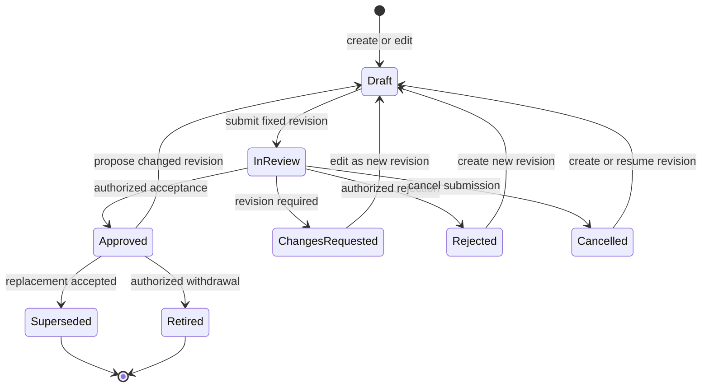

# APPROVAL-002 — Approval Process

- **Status:** Proposed
- **Classification:** Informational process design
- **Scope:** Reusable KGAID capability
- **Depends on:** [APPROVAL-001](APPROVAL-001-vision.md)

## 1. Purpose

This document defines the end-to-end process by which a governed document is
created, changed, submitted, reviewed, accepted, rejected, resubmitted,
superseded or retired through Approval Center.

The process applies to knowledge artifacts held in documents. It complements
the [KGAID Knowledge Lifecycle](../10-knowledge-architecture/13-knowledge-lifecycle.md)
and does not create an alternative knowledge lifecycle.

## 2. Core concepts

| Concept | Meaning |
| --- | --- |
| Document | A container for one or more addressable knowledge artifacts. |
| Revision | A fixed content state that can be compared and reviewed. |
| Accepted version | The exact revision made normative by human authority. |
| Approval case | A bounded request to decide on one revision and scope. |
| Review | Evaluation and recommendation; it is not acceptance. |
| Decision | An authorized human action with rationale and recorded scope. |
| Decision record | Durable evidence of the decision and its exact subject. |

An approval case never refers only to a mutable filename. It binds the
document identity, revision, submitted content, decision scope and applicable
authority. A content change after submission creates a different candidate and
cannot silently retain earlier reviews or approval.

## 3. Roles and separation of responsibility

| Responsibility | Process contribution |
| --- | --- |
| Author or contributor | Creates and edits a candidate revision. |
| Knowledge Owner | Maintains meaning, metadata and readiness of the artifact. |
| Reviewer | Evaluates a declared discipline or concern. |
| Decision Authority | Accepts or rejects within a declared human authority. |
| Knowledge Steward | Maintains structure, identity and traceability quality. |
| AI collaborator | Analyzes, drafts, compares and recommends without deciding. |

One human may perform several responsibilities in a small project, but every
consequential action records the responsibility under which it was performed.
Authorship never grants approval authority by itself.

## 4. Status dimensions

Approval Center keeps independent status dimensions instead of compressing
them into one label.

### 4.1 Knowledge status

Document status follows the governed metadata profile: `draft`, `proposed`,
`accepted`, `deprecated` or `superseded`. It describes the maturity and
authority of the content, not the amount of review activity.

### 4.2 Approval case status

The full Approval Center design may describe a single approval case with the
following workflow states:

| Status | Meaning |
| --- | --- |
| `not-submitted` | No active approval case exists for the revision. |
| `in-review` | A fixed revision has been submitted for review and decision. |
| `changes-requested` | Review found changes needed before a new submission. |
| `approved` | An authorized human accepted the exact revision and scope. |
| `rejected` | An authorized human declined the exact revision and scope. |
| `cancelled` | The submitter or authorized owner ended the case without decision. |

This richer case state is recorded as `case_status`; it is not the governed
Markdown field `approval_status`. The front-matter projection supports only
`pending` and `approved` for compatibility with `kgaid-doc-approval`. Both are
bound to the exact revision and must not be copied to a new or changed
revision.

### 4.3 Other statuses

Implementation and verification status remain independent of both knowledge
and approval status. Approval of a requirement does not prove that it is
implemented, and approval of evidence does not broaden the claim it supports.

## 5. State model

The diagram shows the workflow for a candidate revision. A transition marked
“new revision” starts a distinct revision and approval case while preserving
the earlier record.

The case state `Approved` records a decision about the exact reviewed revision;
it does not derive the document's `status`. An authorized lifecycle decision
may set `status: accepted` in the same governed change. `Rejected`,
`Superseded` and `Retired` case outcomes preserve their historical records. A
requested change is not a rejection: it returns work for revision without
making the candidate normative.

## 6. End-to-end process

### 6.1 Create the document

The author or Knowledge Owner:

1. creates a stable document or artifact identity;
2. states purpose, scope and ownership;
3. identifies available sources, dependencies and assumptions;
4. marks the content as non-normative; and
5. starts a draft revision with provenance.

Transient notes do not require approval. Material becomes governed when it can
affect a decision, requirement, contract, risk, evidence claim or future
interpretation.

### 6.2 Edit and prepare

The author may edit freely while the revision is not submitted. Preparation
includes proportionate checks for:

- required metadata and stable references;
- internal links and relationship validity;
- conflicts with accepted knowledge;
- change summary and rationale;
- affected downstream artifacts;
- required review disciplines and Decision Authority;
- open assumptions, risks and limitations; and
- readiness criteria applicable to the artifact type.

Automated or AI-assisted checks may report findings and recommendations. They
cannot declare the proposal accepted or conceal an unresolved finding.

### 6.3 Submit for approval

Submission creates an approval case for a fixed revision. The case records:

- exact document and revision identity;
- content identity and comparison reference;
- submitted scope and change rationale;
- submitter and submission time;
- required reviewers and Decision Authority;
- readiness findings, known exceptions and open risks; and
- the approval rules applicable at submission time.

Submission fails safely when identity, content or authority is ambiguous. A
project may allow non-blocking findings, but each exception has an owner and
rationale and remains visible to the decision maker.

### 6.4 Review

Each reviewer evaluates the proposal only within the declared review scope.
Review may produce:

- a recommendation to approve;
- a request for changes;
- a recommendation to reject;
- comments or questions;
- identified conflicts, dependencies or affected artifacts;
- conditions or limitations; and
- a need for another authority or specialist review.

Review activity never becomes acceptance through elapsed time, comment count,
majority or automation unless a human Decision Authority explicitly records
the decision. A project may require several reviews, but reviewer completion
and decision authority remain distinct facts.

### 6.5 Request changes

When the proposal can become decision-ready through revision, a reviewer or
Decision Authority requests changes. The approval case retains the submitted
snapshot and findings. Editing produces a new revision and invalidates reviews
whose subject or scope changed.

The author addresses or explicitly responds to findings, updates impact
analysis and submits the new revision. Approval Center shows which findings
were resolved, remain open or no longer apply, without erasing their history.

### 6.6 Approve

An authorized human approves only after the applicable readiness and review
conditions are visible. The decision records:

- document, revision, content and accepted scope;
- accepting person and authority role;
- decision time and rationale;
- satisfied and waived review conditions;
- limitations, conditions and accepted risks;
- previous accepted version, if any; and
- affected relationships and follow-up obligations.

Approval changes knowledge status to `accepted` within the declared scope. If
the new version replaces an accepted version, the process marks the replaced
version `superseded` only when the replacement becomes accepted. Downstream
artifacts remain unchanged until their own owners assess and process the
impact.

### 6.7 Reject

An authorized human rejects a submitted revision when it should not become
accepted knowledge. Rejection records the rationale, scope and unresolved
conditions. It is terminal for that candidate revision and does not alter an
earlier accepted version.

Further work starts a new revision with a new approval case linked to the
rejected one. The author may reuse valid analysis, but the new proposal does
not inherit the rejected case's reviews or decision status.

### 6.8 Reapprove after change

Any semantic change to accepted knowledge re-enters proposal and review:

1. preserve the current accepted version;
2. create a candidate revision linked to it;
3. classify the change and analyze impact;
4. review the exact difference and current full context;
5. obtain a new human decision; and
6. supersede the earlier version only after acceptance of the replacement.

A non-semantic clarification still records its revision and review history.
The applicable KGAID policy determines whether it retains the artifact version
or requires a new version. Approval Center reports the classification; it does
not infer compatibility merely from the size of the textual change.

### 6.9 Cancel a pending case

The submitter or authorized owner may cancel an approval case before decision.
Cancellation preserves the case and review activity but creates no rejection
or acceptance. An existing accepted version remains current.

### 6.10 Withdraw an accepted document

Withdrawal of accepted knowledge means retirement, not deletion. The relevant
human authority:

1. states why and when the document ceases to apply;
2. checks dependants, baselines, evidence and active work;
3. defines transition obligations and effective scope;
4. obtains additional risk or domain decisions where required; and
5. records retirement after the conditions are satisfied.

If a replacement exists, the old version is superseded rather than retired.
Retirement preserves content, decision history and relationships. It prevents
the retired document from appearing as current accepted knowledge while still
supporting historical baselines and audits.

## 7. Decision and validity rules

1. A decision applies only to the submitted revision and declared scope.
2. Only a human with applicable Decision Authority may accept knowledge.
3. AI may recommend, summarize or detect conditions but may not approve.
4. Material content or metadata changes after submission require a new revision.
5. A changed authority, scope, dependency or risk may invalidate a review even
   when document text is unchanged.
6. Missing or conflicting identity causes the process to stop, not guess.
7. An earlier accepted version remains authoritative until it is explicitly
   superseded or retired.
8. Rejection and cancellation of a candidate do not retire an accepted version.
9. Every waiver or accepted risk identifies its human authority and scope.
10. Time-based reminders or escalation do not convert silence into approval.

## 8. Concurrent and grouped changes

Several documents may participate in one coordinated change, but every
decision still identifies its exact subjects. A grouped approval case may be
used only when:

- the documents form one coherent decision boundary;
- all required authorities are identified;
- partial acceptance rules are explicit;
- each accepted revision remains independently addressable; and
- failure of one member cannot leave the set semantically inconsistent.

Parallel proposals against the same accepted version expose their relationship
and potential conflict. Approval of one proposal triggers renewed impact review
of the other; it does not silently rebase its meaning.

## 9. Exceptional conditions

| Condition | Required behavior |
| --- | --- |
| Source unavailable | Preserve last known state and mark freshness uncertain. |
| Metadata invalid | Show findings and block ambiguous consequential decisions. |
| Dependency missing | Keep the proposal non-normative until resolved or waived. |
| Authority unknown | Prevent acceptance and route for governance resolution. |
| Revision changed | Invalidate the affected case and require resubmission. |
| Conflicting decision | Suspend the disputed scope and invoke conflict resolution. |
| History incomplete | Report the gap; never synthesize an approval record. |

## 10. Process outputs

The process produces:

- immutable revision references;
- approval cases and review findings;
- human decision records;
- current and historical knowledge status;
- impact and follow-up obligations;
- supersession or retirement relationships; and
- an auditable event history.

These outputs support governance and traceability. They do not by themselves
prove implementation, verification, release readiness or product correctness.

## 11. Related documents

- [Vision](APPROVAL-001-vision.md)
- [Metadata Specification](APPROVAL-003-metadata-specification.md)
- [Approval Center UI](APPROVAL-004-approval-center-ui.md)
- [Architecture](APPROVAL-005-architecture.md)
- [Roadmap](APPROVAL-006-roadmap.md)
- [Approval Center index](README.md)
