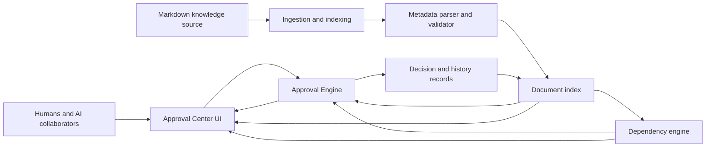
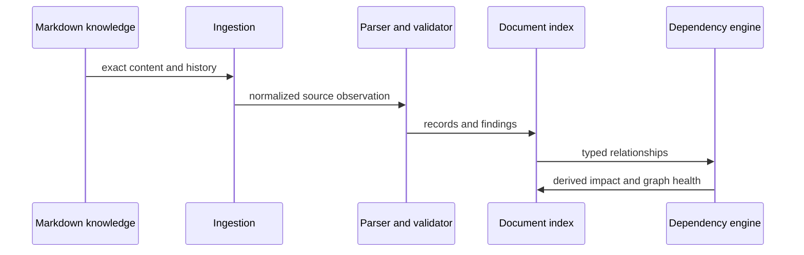

# APPROVAL-005 — Approval Center Architecture

- **Status:** Proposed
- **Classification:** Informational architecture design
- **Scope:** Reusable KGAID capability
- **Depends on:** [APPROVAL-002](APPROVAL-002-approval-process.md),
  [APPROVAL-003](APPROVAL-003-metadata-specification.md),
  [APPROVAL-004](APPROVAL-004-approval-center-ui.md)

## 1. Purpose

This document defines the conceptual architecture of Approval Center. It
allocates responsibilities, information authority and processing boundaries
without selecting implementation technologies, frameworks, protocols, storage
products or APIs.

## 2. Architectural context

Approval Center surrounds, but does not replace, the governed knowledge source.
It reads Markdown and associated governance information, builds derived views,
coordinates review and records human decisions for exact revisions.

Arrows show conceptual information flow, not a required protocol or deployment
topology.

## 3. Sources of authority

The architecture separates authoritative and derived information.

| Information | Authoritative source |
| --- | --- |
| Knowledge content | Exact versioned Markdown revision. |
| Artifact identity and lifecycle | Governed document metadata. |
| Human approval or rejection | Durable decision record bound to a revision. |
| Relationship meaning | Typed relationship on its authoritative owner. |
| Downstream dependants | Derived inverse relationship index. |
| Dashboard counts and summaries | Rebuildable projection of indexed records. |
| AI analysis | Clearly marked recommendation with source context. |

The document index, graph and UI never become independent owners of knowledge
meaning. If a derived representation disagrees with its source, Approval Center
reports the inconsistency and prevents ambiguous decisions.

## 4. Component responsibilities

### 4.1 Markdown knowledge source

The Markdown knowledge source owns human-readable project knowledge and its
durable revision history. Its responsibilities are to:

- preserve exact content submitted and accepted;
- provide stable artifact identity or addressable anchors;
- retain authoring provenance and version history;
- expose declared metadata and relationships; and
- remain usable without Approval Center.

Approval Center does not require Markdown to carry every operational record in
the same file. Placement remains an adoption decision, provided the content and
its metadata and decisions can be bound unambiguously.

### 4.2 Source adapter and ingestion

The ingestion boundary discovers governed Markdown and relevant history. It:

- identifies added, changed, moved and removed source items;
- resolves a document location without treating location as identity;
- supplies exact revisions for parsing and comparison;
- detects freshness and partial-read conditions;
- preserves project and knowledge-space boundaries; and
- emits normalized source observations for downstream processing.

It does not interpret approval policy or invent metadata missing from the
source.

### 4.3 Metadata parser

The metadata parser extracts declared information independently of its eventual
serialization. It:

- recognizes document, revision, relationship and status fields;
- normalizes values into the shared semantic model;
- retains source location and provenance for every parsed value;
- distinguishes absent, unknown, empty and invalid information; and
- supports project extensions without redefining core semantics.

Parsing answers what information is present. It does not decide whether the
information is sufficient or authoritative.

### 4.4 Metadata and integrity validator

The validator evaluates parsed records against KGAID and project rules. It:

- checks identity, required fields and allowed status transitions;
- verifies that decisions resolve exact revisions and human authority;
- detects approval inherited by changed content;
- validates relationship targets and version lineage;
- evaluates readiness rules and project-profile requirements;
- assigns transparent severity and affected scope; and
- produces findings without modifying source knowledge.

The validator fails closed for ambiguous consequential decisions. It may allow
non-blocking investigation when the applicable policy permits it.

### 4.5 Document index

The document index is a rebuildable projection optimized for discovery and
review. It contains:

- document and revision identities;
- parsed and validated metadata;
- searchable content references;
- current and historical status projections;
- approval-case and decision references;
- source freshness and validation findings; and
- relationship edges needed by other components.

The index does not become evidence that source content exists or is accepted.
Every indexed fact retains a route to its authoritative source and revision.

### 4.6 Dependency and traceability engine

The dependency engine interprets typed relationships. It:

- resolves direct upstream links;
- derives inverse downstream links;
- detects missing targets, cycles, conflicts and incompatible versions;
- computes bounded impact neighborhoods and traceability paths;
- identifies accepted knowledge affected by a candidate change;
- relates evidence to exact claims and scopes; and
- exposes the reason and direction for each relationship.

Impact output is a review aid. It identifies candidates for assessment and does
not claim that every connected artifact must change or that an unlinked
artifact is unaffected.

### 4.7 Approval Engine

The Approval Engine coordinates the process in
[APPROVAL-002](APPROVAL-002-approval-process.md). It:

- creates approval cases for fixed revisions;
- evaluates readiness, reviewer and Decision Authority requirements;
- manages review findings and their disposition;
- invalidates stale reviews when their subject changes;
- permits only valid, authorized state transitions;
- records approval, rejection, cancellation, supersession and retirement;
- creates follow-up and impact obligations; and
- prevents silence, elapsed time or AI action from becoming human acceptance.

The engine enforces declared rules but does not decide whether a proposal is
correct. Human Decision Authority remains outside automated logic.

### 4.8 Decision and history records

Decision and history records preserve:

- approval cases and submitted snapshots;
- review outcomes and dispositions;
- decisions, actors, authority roles, scope and rationale;
- conditions, limitations, waivers and accepted risks;
- status transitions and invalidations;
- version, supersession and retirement lineage; and
- corrections to earlier records without erasing the original event.

Records must support historical reconstruction and integrity verification.
Their physical representation and location remain open design decisions.

### 4.9 Change comparison capability

The comparison capability produces review-oriented differences between exact
revisions. It:

- compares content, metadata and relationships;
- supports the previous accepted version as the default reference;
- distinguishes movement from addition or removal where possible;
- keeps full-document context available;
- accepts author-supplied change rationale; and
- labels semantic analysis from AI as advisory.

It never classifies a change as compatible solely from textual size or shape.

### 4.10 Web UI

The Web UI presents dashboard, queue, filters, document detail, comparison,
traceability, relationships and history. It:

- preserves project, revision, status and source context across views;
- exposes actions according to current responsibility and authority scope;
- distinguishes authoritative, derived and AI-generated information;
- explains blockers, freshness and unavailable data;
- gathers explicit human review and decision input; and
- remains a projection and interaction surface, not a knowledge source.

The term Web UI identifies the intended human-accessible product surface. It
does not choose a framework, rendering model or deployment architecture.

### 4.11 Notification and follow-up coordinator

This component identifies attention required by process events. It:

- routes assigned review and decision work;
- reports invalidated reviews and changed dependencies;
- alerts owners to accepted upstream changes and retirement;
- tracks decision conditions and follow-up obligations; and
- links every message to an exact reason and subject.

Notification delivery is replaceable. A notification is never the decision
record or the sole source of current status.

### 4.12 Governance configuration

Governance configuration expresses project tailoring, including:

- governed artifact types and required metadata;
- role and authority assignments;
- review disciplines and readiness conditions;
- blocking and non-blocking validation rules;
- minimum or extended profile selection;
- retention and visibility boundaries; and
- effective versions of approval rules.

Configuration may constrain the shared process but cannot grant AI human
acceptance authority or redefine accepted KGAID semantics.

## 5. Principal information flows

### 5.1 Discover and index

A failed parse remains visible as a source item with findings where identity
can be established. It does not disappear from the approval landscape.

### 5.2 Submit and review

1. The UI resolves the candidate through the index to exact source content.
2. The Approval Engine checks freshness, integrity, readiness and authority.
3. Submission fixes the revision and comparison reference.
4. Reviewers inspect content, diff, metadata and impact and record findings.
5. A changed revision invalidates the affected case and reviews.

### 5.3 Decide

1. The engine rechecks revision identity, authority and blocking conditions.
2. The UI shows full decision scope, unresolved conditions and impact.
3. The human records approval or rejection and rationale.
4. A durable decision record is created before status is projected as changed.
5. The index and dependency engine refresh derived views and follow-up work.

If recording the decision cannot be completed reliably, the process reports no
successful decision. Presentation must not get ahead of durable history.

### 5.4 Change accepted knowledge

1. The accepted revision stays available and authoritative.
2. A candidate revision is indexed separately.
3. Comparison and dependency analysis identify possible impact.
4. The candidate completes a new approval case.
5. Only its acceptance may supersede the earlier version.
6. Affected downstream items enter their own review process.

### 5.5 Retire knowledge

The engine requires retirement rationale, applicable authority, impact review
and effective scope. The accepted content and history remain readable after
retirement, while current views stop presenting it as applicable knowledge.

## 6. Consistency and synchronization

Approval Center must handle independent changes to source content, metadata,
authority and decision history. The architecture uses these rules:

1. every projection declares source revision and freshness;
2. submission and decision revalidate the exact source state;
3. changed content invalidates approval for the earlier candidate;
4. derived indexes can be discarded and rebuilt;
5. durable decisions are never reconstructed from dashboard state;
6. ambiguous identity or conflicting records block acceptance; and
7. recovery preserves events or explicitly reports a historical gap.

Temporary unavailability may degrade browsing or analysis. It must not result
in an approval against a revision whose identity was not confirmed.

## 7. Security and trust boundaries

The conceptual architecture distinguishes:

- contributors who may propose content;
- reviewers who may record scoped evaluation;
- human authorities who may decide;
- automation that may validate and coordinate;
- AI that may analyze and recommend; and
- observers with historical or audit visibility.

Consequential actions require authenticated actor identity, applicable scoped
authority, exact subject integrity and an attributable event. Visibility of
sensitive knowledge and personal metadata follows project boundaries and
retention obligations.

No component treats generated text, a reviewer majority, a permission label or
an external notification as proof of human acceptance.

## 8. Architectural qualities

| Quality | Required outcome |
| --- | --- |
| Auditability | Reconstruct exact content, context, actor, authority and decision. |
| Integrity | Detect changed content and unauthorized record alteration. |
| Explainability | Show why a case is blocked, routed or considered affected. |
| Portability | Preserve semantics across projects and implementation choices. |
| Rebuildability | Recreate all derived indexes and views from authoritative data. |
| Resilience | Expose partial or stale data and fail safely for decisions. |
| Scalability | Support one-person projects and multi-project governance. |
| Accessibility | Offer complete non-graph and non-color-dependent interaction. |
| Evolvability | Add document types and policies without redefining core meaning. |
| Proportionality | Apply governance depth appropriate to risk and consequence. |

## 9. Deployment-neutral boundaries

The components in this document are responsibility boundaries, not mandatory
runtime units. A local prototype may combine them. A mature Approval Center may
separate them for scale, ownership or reliability. Either arrangement conforms
when it preserves:

- authoritative-source boundaries;
- exact revision binding;
- human decision authority;
- durable and attributable history;
- derived-index rebuildability; and
- technology-neutral KGAID semantics.

## 10. Architecture decisions deferred

Implementation work must decide later, with evidence from the roadmap stages:

- metadata and decision-record representation;
- source discovery and change-detection mechanisms;
- indexing and comparison realization;
- identity and authority integration;
- history integrity and retention mechanisms;
- notification delivery;
- local and multi-project topology; and
- operational quality targets.

This architecture intentionally does not define APIs or select technologies.

## 11. Related documents

- [Vision](APPROVAL-001-vision.md)
- [Approval Process](APPROVAL-002-approval-process.md)
- [Metadata Specification](APPROVAL-003-metadata-specification.md)
- [Approval Center UI](APPROVAL-004-approval-center-ui.md)
- [Roadmap](APPROVAL-006-roadmap.md)
- [Approval Center index](README.md)
