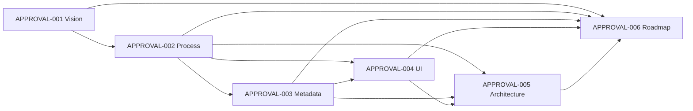

# KGAID Approval Center

- **Status:** Proposed
- **Classification:** Informational solution design
- **Scope:** Reusable KGAID capability

## Purpose

This directory defines the technology-neutral design of Approval Center, a
future KGAID capability for reviewing, deciding on and tracing governed
knowledge. Approval Center makes approval work visible without replacing the
Markdown knowledge source or human decision authority.

The design applies to any project adopting KGAID. The 3ksef project is the
first intended pilot and is not a source of product-specific requirements for
the module.

## Design principles

- Markdown knowledge remains the authoritative content source.
- Accepted knowledge changes only through an explicit human decision.
- Authorship, review, approval, implementation and verification are distinct.
- Every decision applies to an exact document revision and declared scope.
- History is preserved; rejection, supersession and retirement are not erasure.
- Indexes, dashboards and relationship views are derived representations.
- The design does not prescribe a framework, storage product, protocol or API.

## Documents

Read the documents in this order:

1. [APPROVAL-001 — Vision](APPROVAL-001-vision.md) defines the problem,
   outcomes, boundaries and place of Approval Center in KGAID.
2. [APPROVAL-002 — Approval Process](APPROVAL-002-approval-process.md)
   defines the end-to-end lifecycle, decisions and state transitions.
3. [APPROVAL-003 — Metadata Specification](APPROVAL-003-metadata-specification.md)
   defines information requirements without choosing a serialization format.
4. [APPROVAL-004 — Approval Center UI](APPROVAL-004-approval-center-ui.md)
   defines future user capabilities and views.
5. [APPROVAL-005 — Architecture](APPROVAL-005-architecture.md) defines
   component responsibilities, information flow and architectural qualities.
6. [APPROVAL-006 — Roadmap](APPROVAL-006-roadmap.md) defines the staged path
   from a local prototype through the 3ksef pilot to KGAID adoption and the
   complete Approval Center.

## Relationship to KGAID

Approval Center operationalizes existing KGAID semantics rather than
redefining them:

- the [Artifact Model](../10-knowledge-architecture/12-artifact-model.md)
  defines governed artifacts and status dimensions;
- the [Knowledge Lifecycle](../10-knowledge-architecture/13-knowledge-lifecycle.md)
  defines proposal, review, human acceptance and evolution;
- the [Authority Model](../10-knowledge-architecture/14-authority-model.md)
  defines scoped human authority and AI boundaries;
- the [Traceability Model](../10-knowledge-architecture/15-traceability-model.md)
  defines relationship direction and impact analysis; and
- the [Governance and Release Model](../50-governance/governance-and-release-model.md)
  governs changes to KGAID itself.

Where this proposed design and an accepted KGAID model differ, the accepted
model remains authoritative.

## Document dependency map

